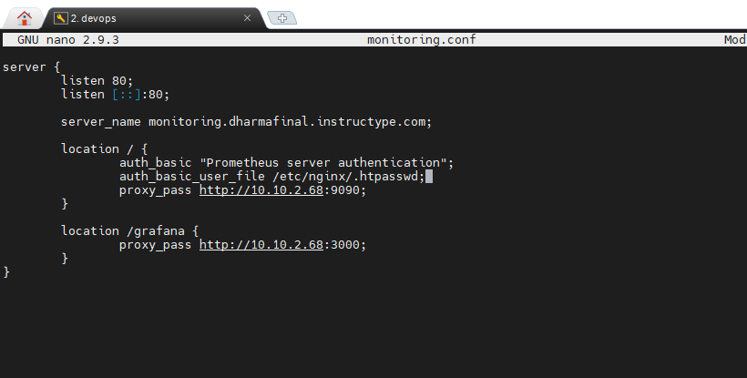
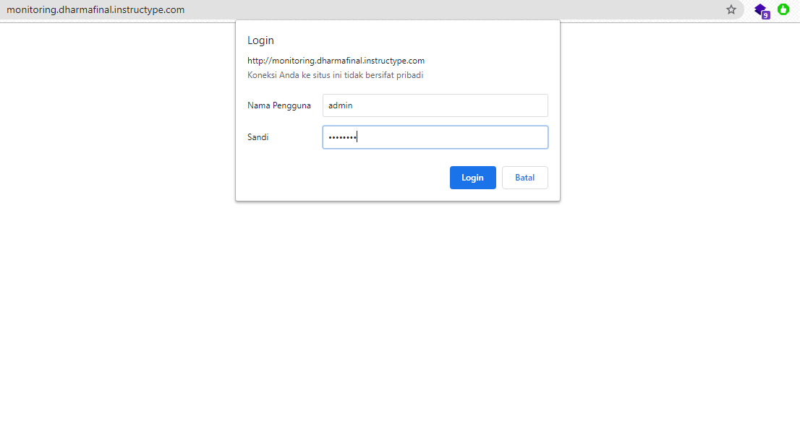
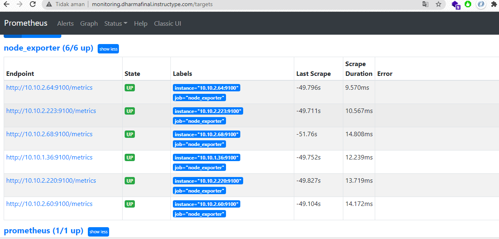

# AUTH

- pertama yang saya lakukan adalah menjalankan perintah berikut untuk membuat username dan password login ke prometheus 
```
sudo apt-get install apache2-utils
sudo htpasswd -c /etc/nginx/.htpasswd admin
```

- berikut settingan reverse proxy untuk prometheus dan grafana dilakukan subpath dengan /grafana



- Lakukan pengujian terhadap akses web monitoring pada browser



- Berikut hasil dari konfigurasi authentikasi untuk prometheus



