# CI/CD

Untuk schema diminta mendeploy aplikasi ketika ada commit dengan branch production.

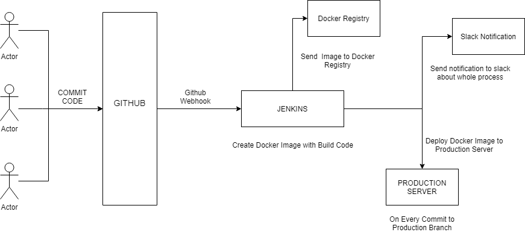

- Melakukan install jenkins melalui ansible, hal yang perlu diperhatikan adalah volume untuk jenkins, agar konfigurasi yang sudah dibuat tidak hilang begitu saja.

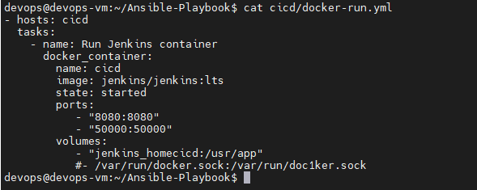

- Setelah melakukan proses instalasi jenkins tambahkan server untuk publish over ssh dengan key private yang ada pada server remote.

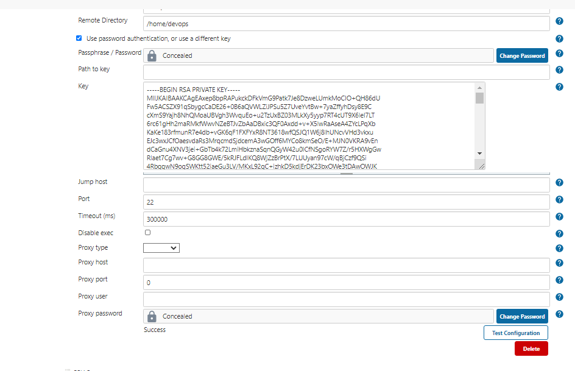

- Membuat personal token terhadap githu repo, agar jenkins mendapatkan informasi ketika ada perubahan pada repo github.

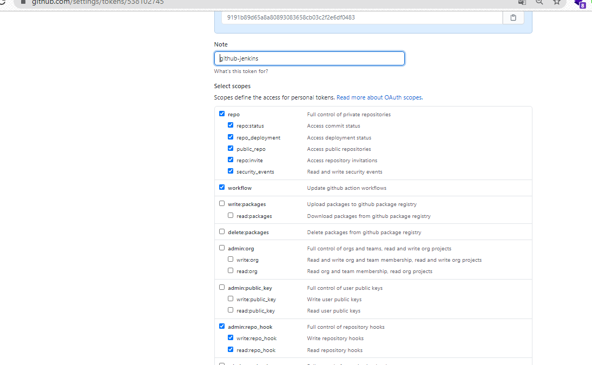

- Lalu masukan personal token ke dalam credential dengan type secret text.

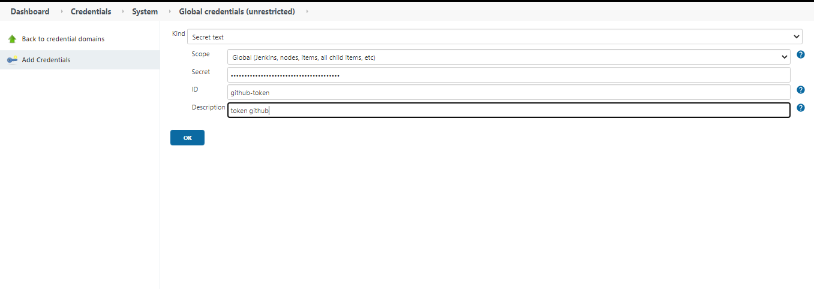

- Setelah itu hubungkan jenkins dengan server github.

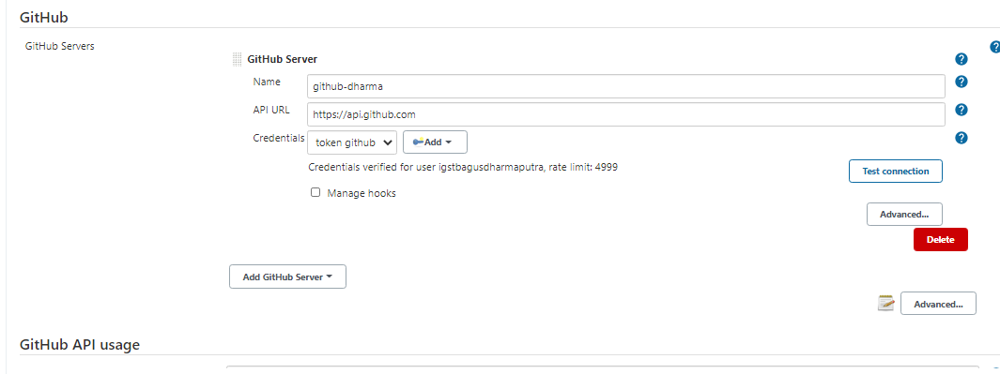

- Tambahkan credential dengan ssh key pada server, agar tidak memerlukan login username atau password pada saat proses git.

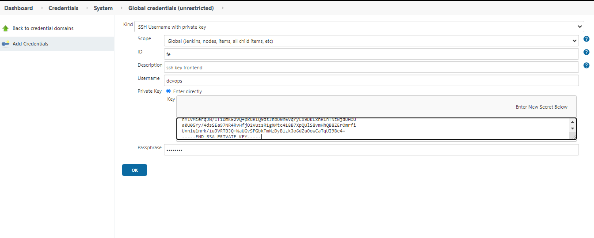

- Tambahkan slack token untuk slack notification.

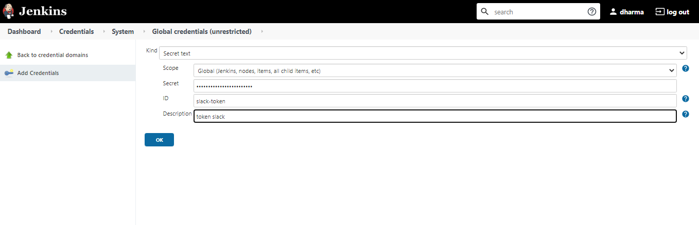

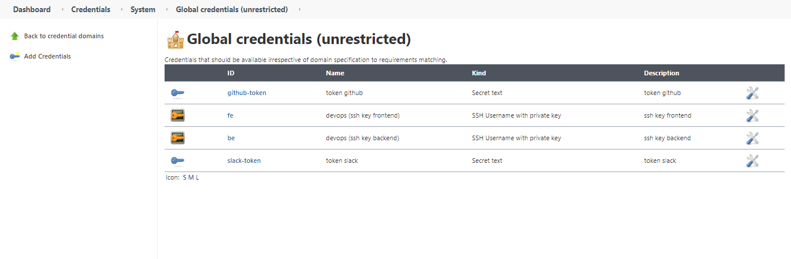

- Hubungkan jenkins dengan slack notification.

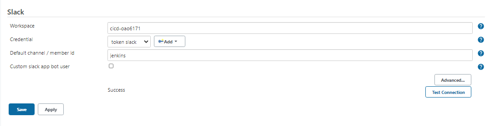

- Membuat proses job atau freestyle projec pada jenkins dan memasukan url project.

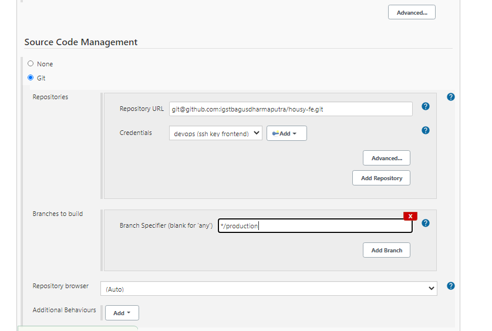

- Untuk build proses trigger ketika github sudah melakukan proses push.

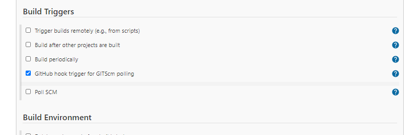

- Berikut proses build yang digunakan.

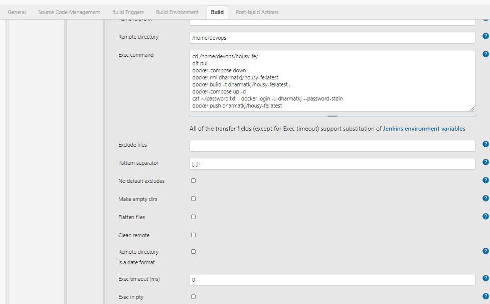

- Untuk proses setelah melakukan job, makan dilakukan proses notification dengan slack.

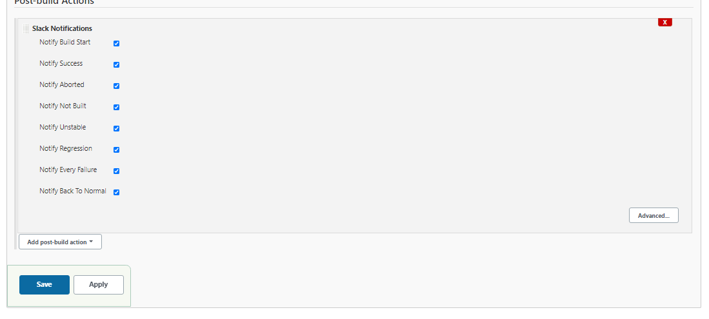

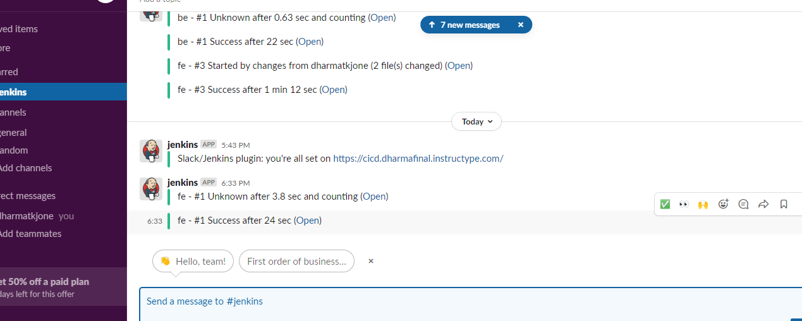

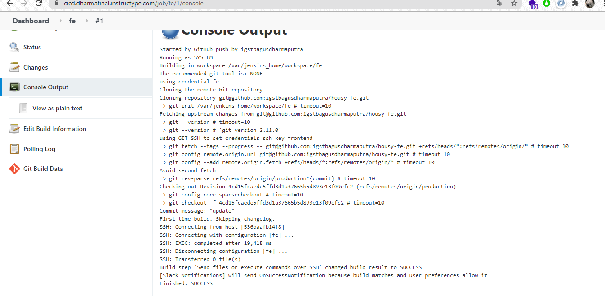