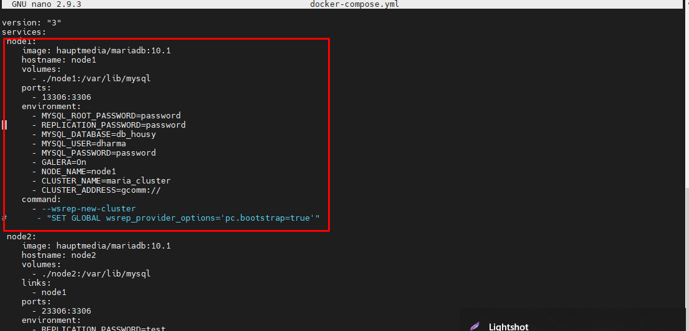

# DATABASE CLUSTER

Databse cluster menggunakan docker sebagai container untuk aplikasi database di cluster dan memerlukan load balancing pada cluster untuk membagi beban traffic serta melakukan backup traffic jika salah satu container atau node mengalami down. Untuk schema dari database cluster dapat dilihat seperti gambar berikut.

- Untuk konfigurasi menggunakan docker-compose dan melakukan beberapa setup seperti USERNAME,PASSWORD dan DATABASE pada node database dan untuk node 1 diperlukan inisiasi cluster yang nantinya pada node lain akan join pada cluster tersebut.

- Melakukan load balancing dengan nginx

- Melakukan setup bootstrap pada file yang ada pada /var/lib/mysql dengan tujuan untuk dapat melakukan proses volume pada docker dan setup galera cluster.

- Uji coba melakukan docker exec pada salah satu container database.

- Berikut hasil uji coba ketika database dibuat disalah satu node, maka node lainnya akan tersinkron dengan database yg sudah dibuat.

