# DEPLOYMENT

- Pertama melakukan clone terhadap repository yang sudah dibuat, dengan menggunakan ansible.

- Membuat docker image pada frontend.

- Jalankan aplikasi dengan ansible.

- Melakukan prose build image dan push ke docker hub.

- Untuk backend proses pembuatan docker image.

- Running app dengan ansible.

- Reverse proxy pada aplikasi yang digunakan.

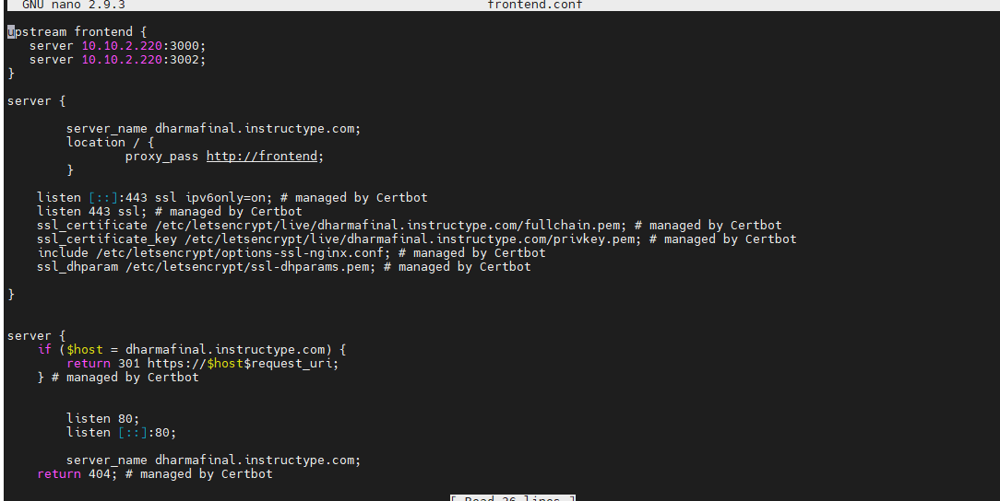

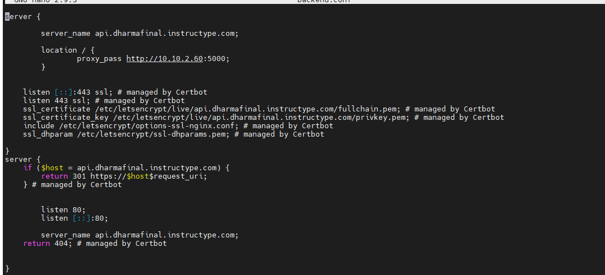

- Untuk CD/CD dan Monitoring.

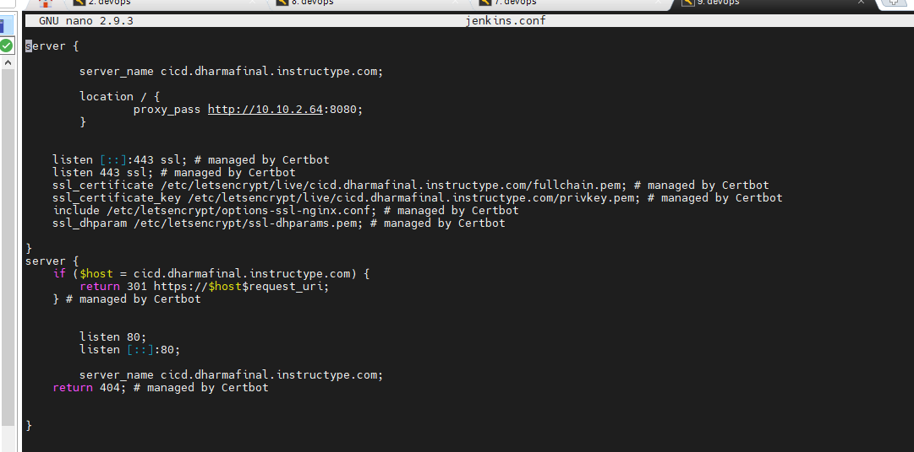

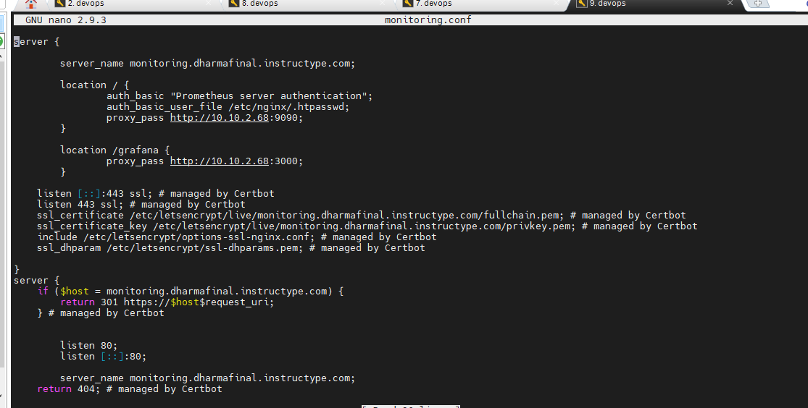

- Berikut halaman web housy application.

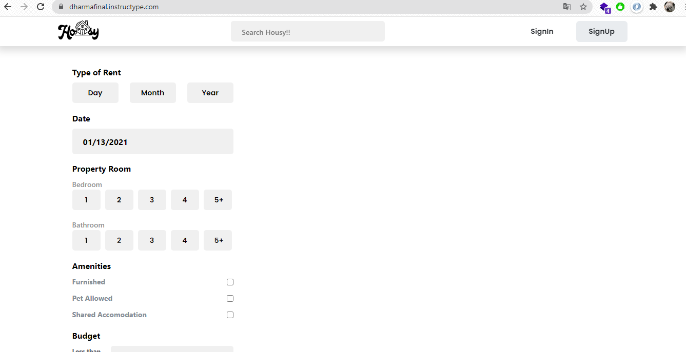

- Dan hasil dari deploy app backend API.

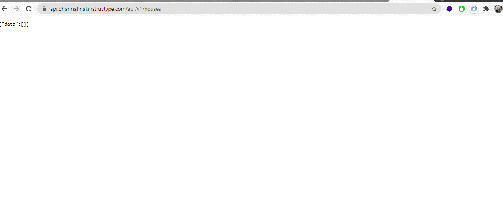

- Selanjutnya hubungkan aplikasi frontend dengan aplikasi backend yang sudah terdeploy.

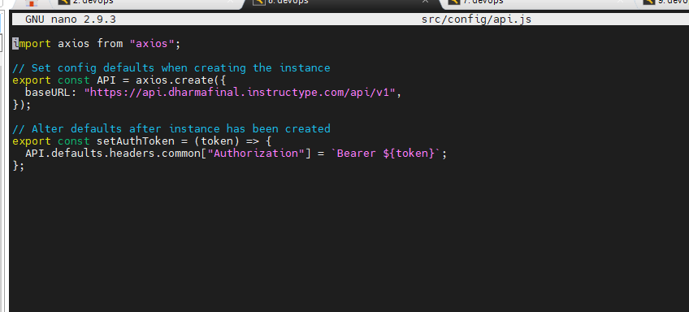

- Sebelum migrate lakukan konfigurasi config.json

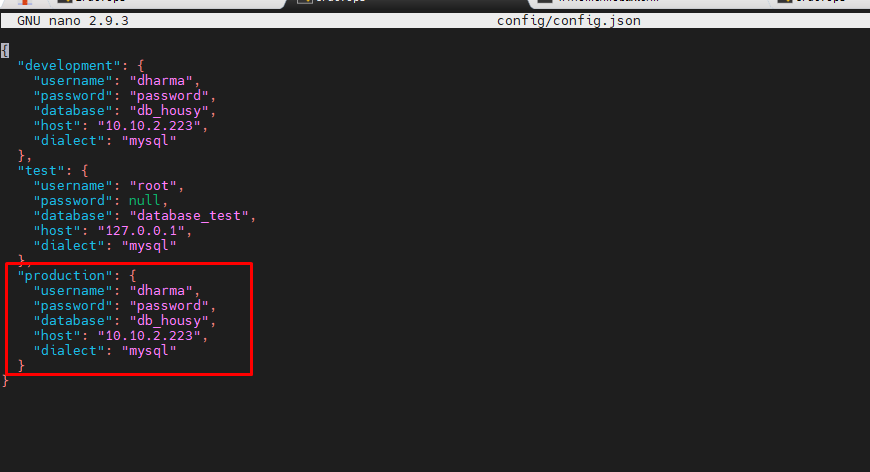

- Jalankan aplikasi backend dengan docker, lalu lakukan proses migrate database didalam container.

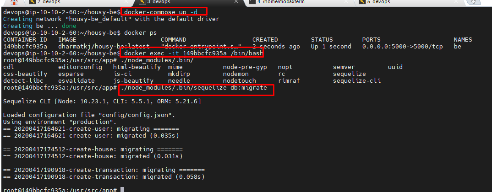

- Sebelum migrate lakukan konfigurasi config.json

- Berikut hasil sebelum dan sesudah migrate database.

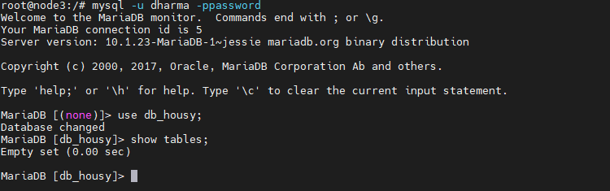

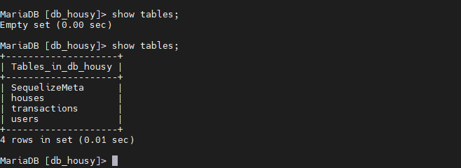

- Lakukan pengujian dengan aplikasi backend untuk membuat user melalui Postman.

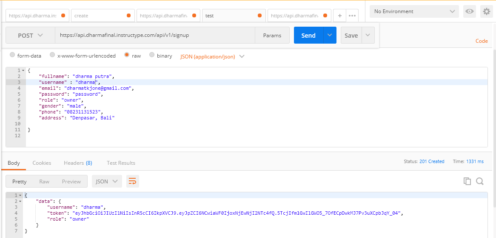