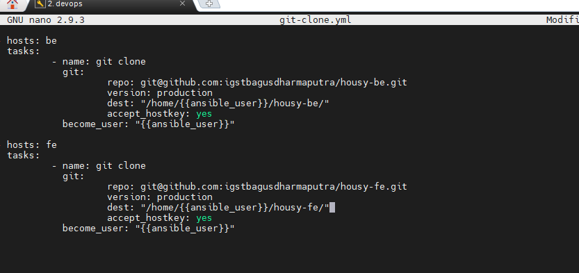
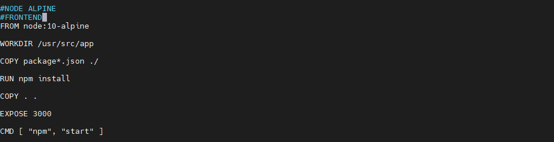
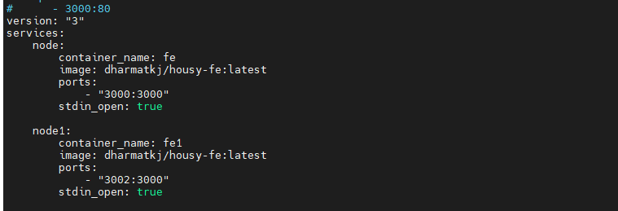
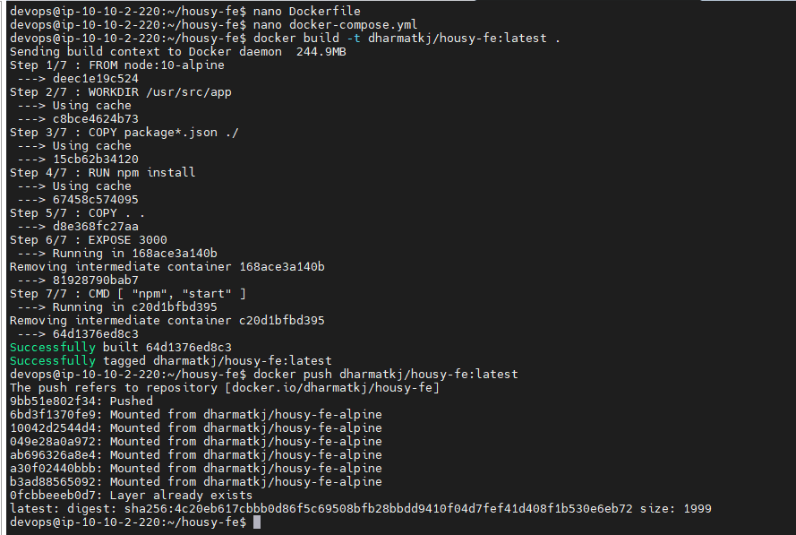
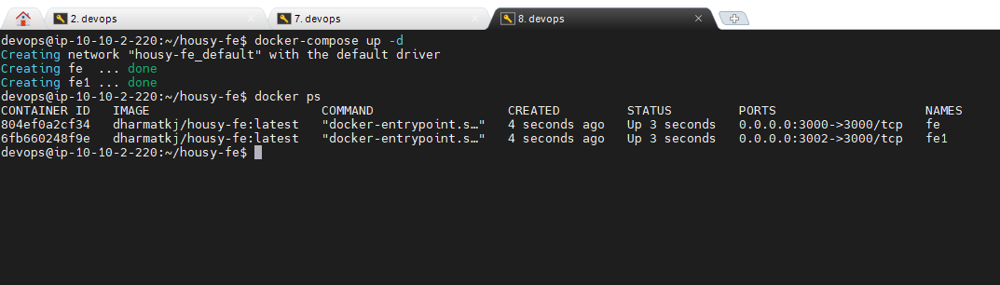
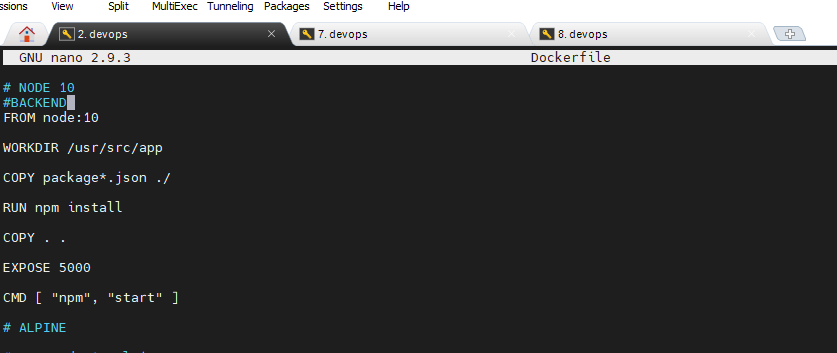
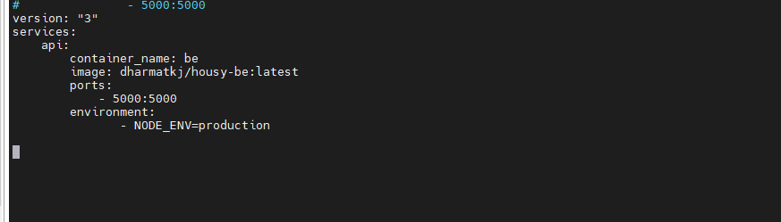
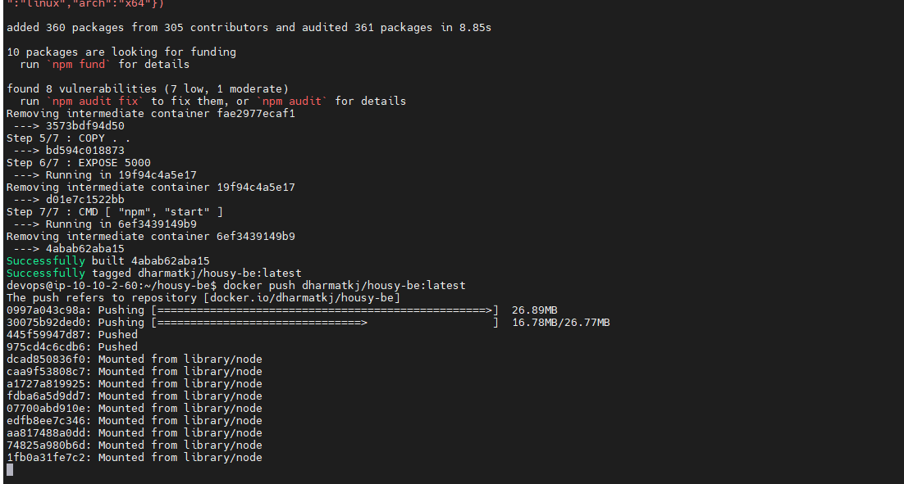
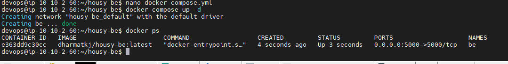

# DEPLOYMENT

- Pertama melakukan clone terhadap repository yang sudah dibuat, dengan menggunakan ansible.

- Membuat docker image pada frontend.

- Jalankan aplikasi dengan ansible.

- Melakukan prose build image dan push ke docker hub.

- Untuk backend proses pembuatan docker image.

- Running app dengan ansible.

