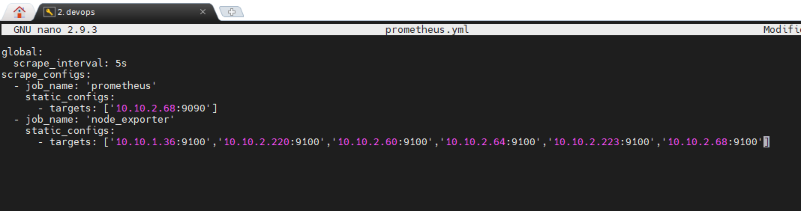
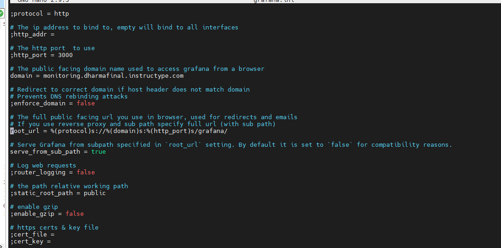

# MONITORING

- Membuat file .yml untuk konfigurasi prometheus.

- Selanjutnya membuat otomaasi konfigurasi prometheus dan grafana.

- Lakukan edit konfigurasi `grafana.ini` pada directory grafana di server monitoring yang bertujuan untuk mengubah alamat grafana dengan subpath.

- Berikut tampilan monitoring dari grafana yang saya explore.

- Untuk menggunakan template dashboard, dapat melakukan import file .json

