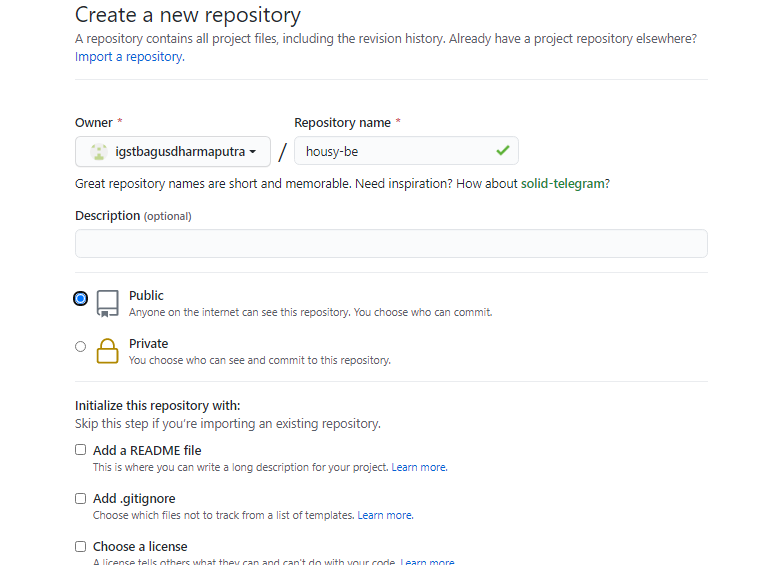
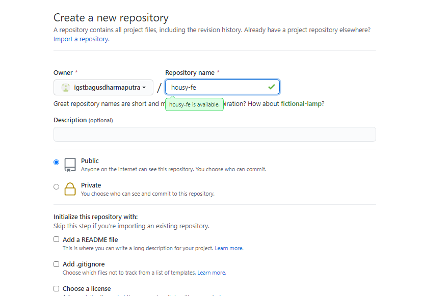
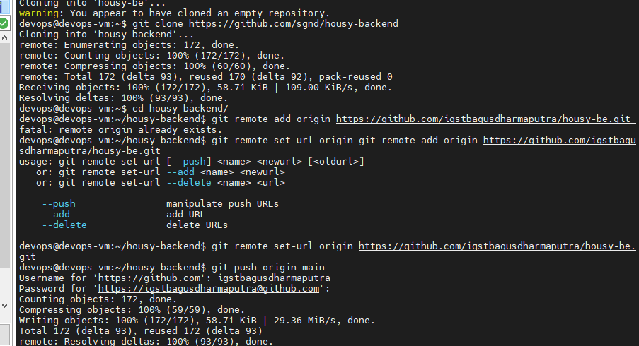
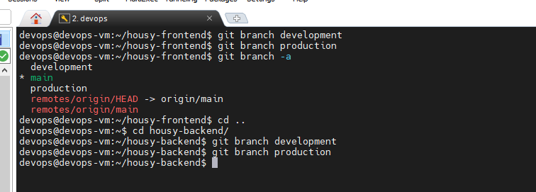
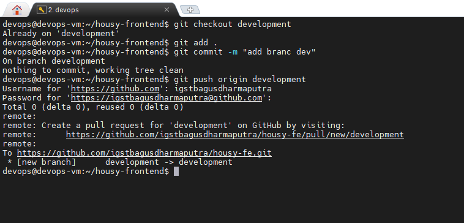
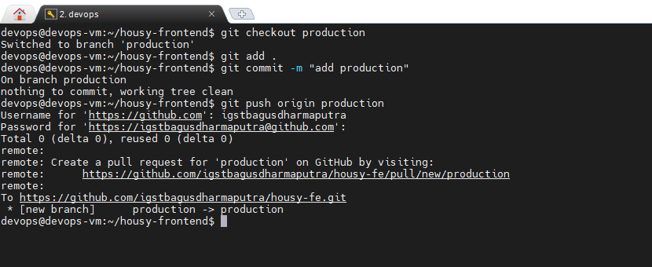
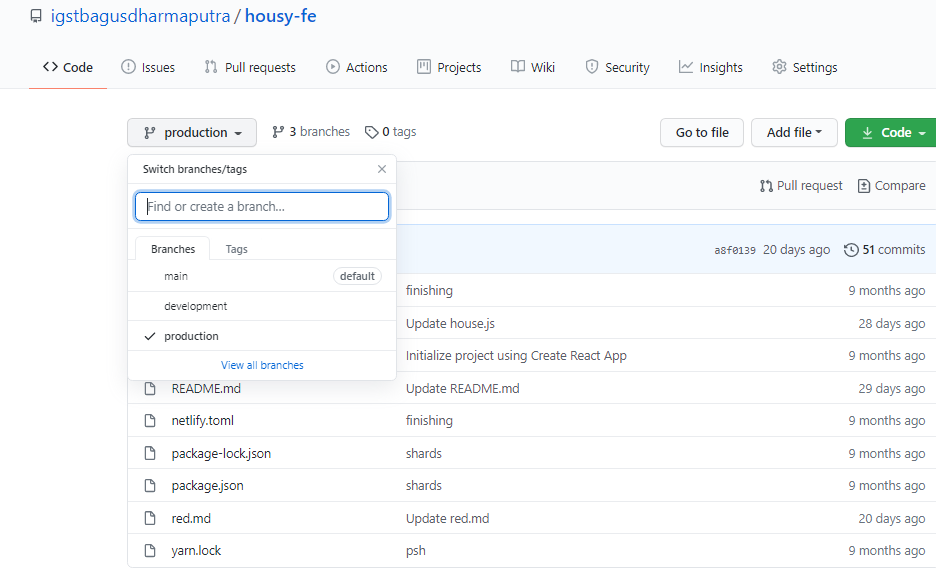

# REPOSITORY

- Pertama membuat repository untuk web housy frontend dan api backend housy.

- Clone repository dari project repo mas sugeng untuk nantinya saya masukan ke repo private dengan branch production

- buat branch baru yaitu development dan production

