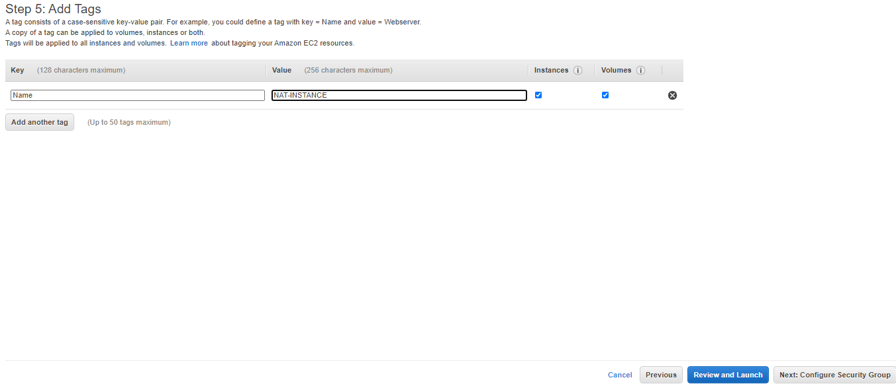
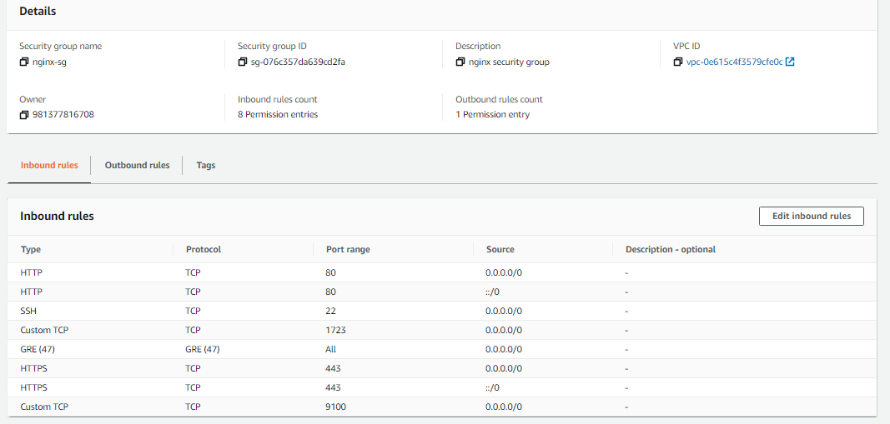
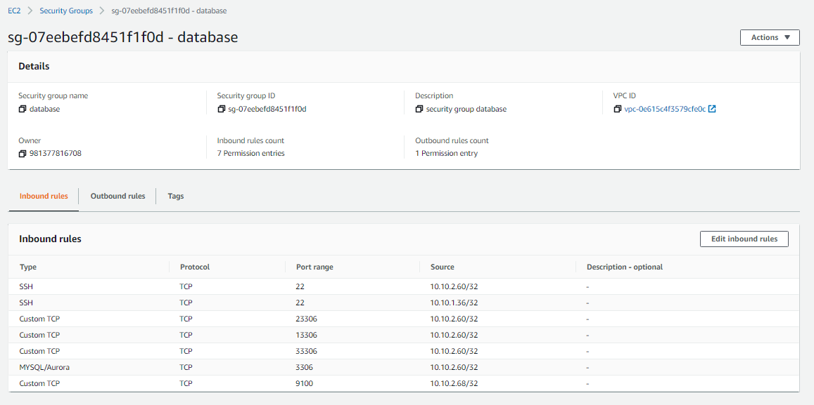

# SERVER

- Pertama buat VPC terlebih dahulu atau bisa menggunakan VPC Default.

- buat subnet untuk public yang terhubung dengan NAT instance, dan private yang terhubung ke server lain

-  Selanjutnya pembuatan nat instance dengan memilih community AMI dan pilih nat hvm

- Untuk konfigurasi server sesuaikan dengan kebutuhan atau spesifikasi yang diperlukan pada aplikasi, dan bagian configure subnet pilih yang public dan assign di enabled.

- Untuk security group kita open all network traffic agak semua sever dapat akses

- Buat keypair baru dan lakukan download.

- Setelah melakukan konfigurasi atau installasi pada nat instance, selanjutnya matikan source/destination check agar tidak mengganggu traffic jaringan internet dikarenakan aws akan mematikan internet ketika ada traffic yang tidak wajar.

- Membuat route table untuk subnet public dan private dan assosiasikan sesuai dengan nama yang dibuat.

- Selanjutnya membuat internet gateway untuk menghubungkan ke jaringan internet pada subnet public 

- Lalu attach VPC yang digunakan

- Selanjutnya masukan router internet gateway pada subnet public dan nat instance pada subnet private.

- Buat server public atau sever nginx dengan menggunakan sistem operasi ubunt server dan auto assign public ip "Disable" dikarenakan untuk server nantinya menggunakan ip elastic atau ip public static.

- Alokasikan elastic ip agara server nginx dapat diakses secara public dan mendapatkan akses internet 

- Untuk konfigurasi server yang lain kurang lebih sama, hanya saja security group dan konfigurasi network untuk server private yang berbeda.

- Untuk melakukan remote ke server private, lakukan login terlebih dahulu ke server nginx, maka perlu menambahkan ssh key aws ke server nginx untuk melakukan proses login.

