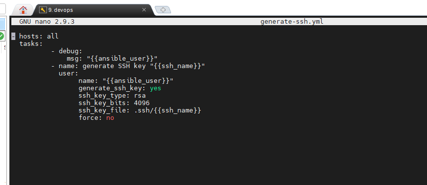
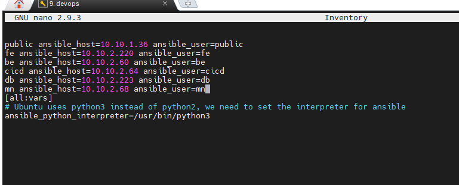
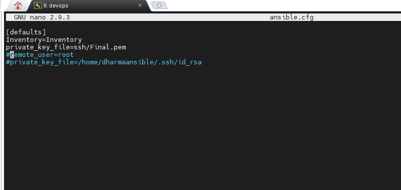
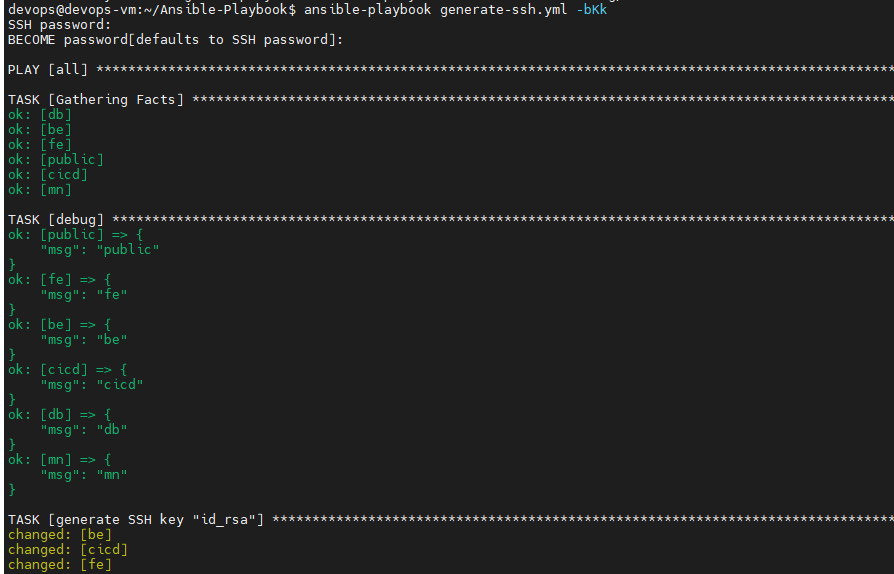
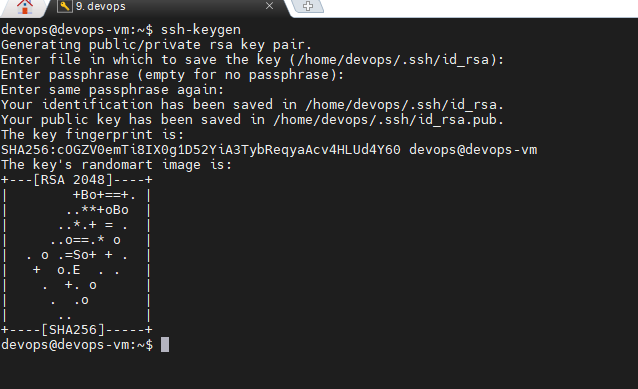
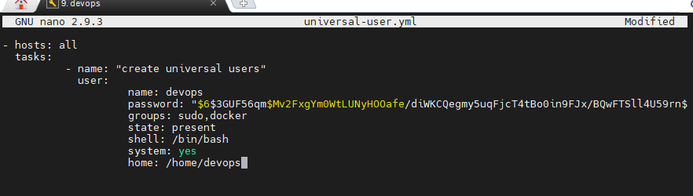
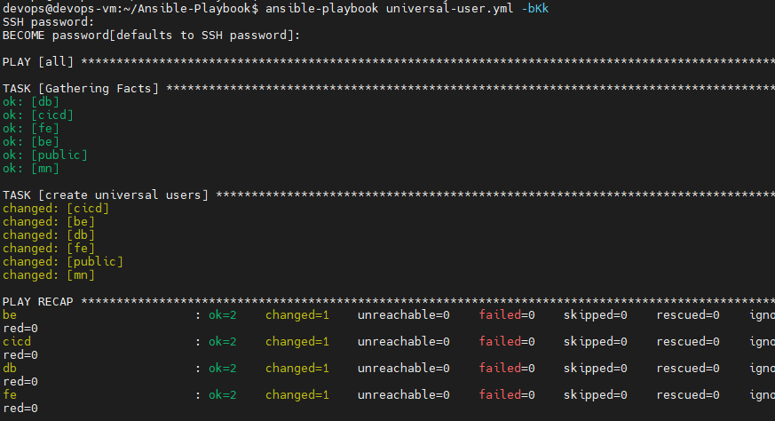
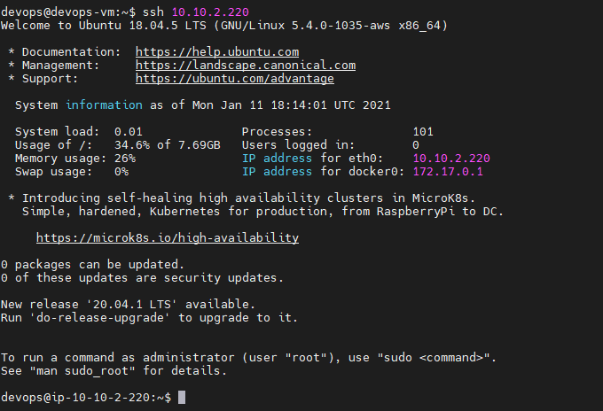

# SSH

- buat file .yml untuk generate ssh dari server private lain

- tambahkan ansible_user pada Inventory

- comment root pada ansible.cfg dikarenakan melakukan remote dengan user yang sudah dibuat dan run file .yml untuk generate ssh. saya menggunakan
keterangan -bkK:
		- b = become
		- k = ask ssh pass
		- K = ask become pass

-  Melakukan generate ssh-keygen pada laptop atau host yang terdapat ansible dan lakukan `ssh-copy-id ke semua server`

- Membuat user universal terhadap semua server, user yang dibuat usahakan sesuaikan dengan user ansible.

- Coba melakukan remote dengan hostname atau ip address.

