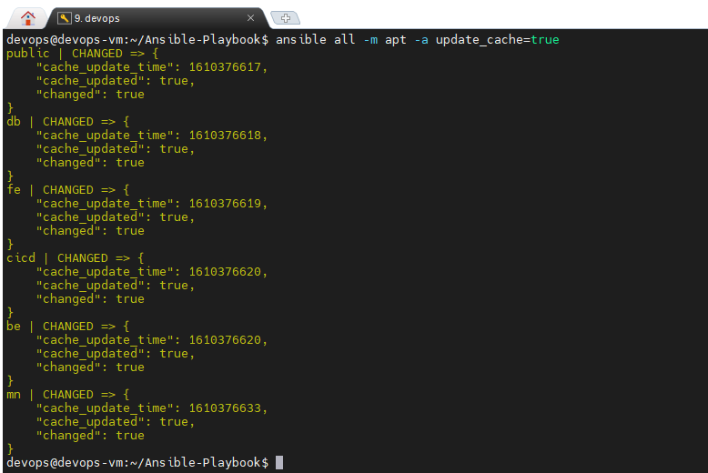

# USER

- Install aplikasi ansible pada laptop atau pc 

NB: Untuk proses ansible memerlukan akses VPN server, laptop atau user ansible bisa mengakses server private pada aws, untuk cara dapat dilihat pada tutorial task bonus Access Private Network From External Network [VPN Server](https://github.com/igstbagusdharmaputra/DumbwaysBootcamp/tree/master/dumbweek2/Access%20Private%20Network%20From%20External%20Network)

- Selanjutnya copykan ssh key aws pada folder project ansible.

- Buat file invetory untuk menampung host atau ip pada setiap server yang terhubung.

- Untuk konfigurasi ansible.cfg, perlu inisialisasi Inventory, private key dan remote user untuk melakukan proses ansible.

- Sebelum login ke server private dengan user root, kita edit file authorized_keys dengan menghilangkan karakter sebelum ssh-rsa

- Lakukan test ping ansible dari ansible.

-  Lakukan update dan upgrade secara bersamaan terhadap server yang terhubung dengan ansible.

- Buat file .yml untuk melakukan installasi docker dan node exporter akan digunakan untuk monitoring dengan prometheus yang menghubungkan semua server.

- Install mkpasswd(whois) untuk generate password enkripsi dengan metode sha-512

- Buat file .yml untuk membuat user pada masing-masing server.

- Serta melakukan edit file konfigurasi ssh pada Password Authentication.

- Melakukan uji coba remote dengan user yang sudah dibuat.

