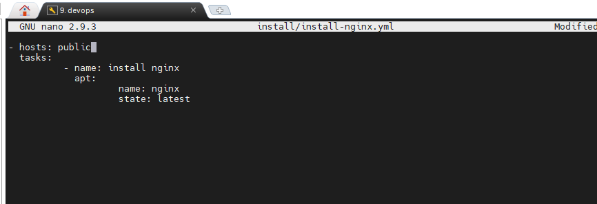
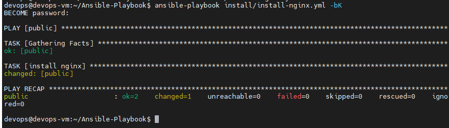
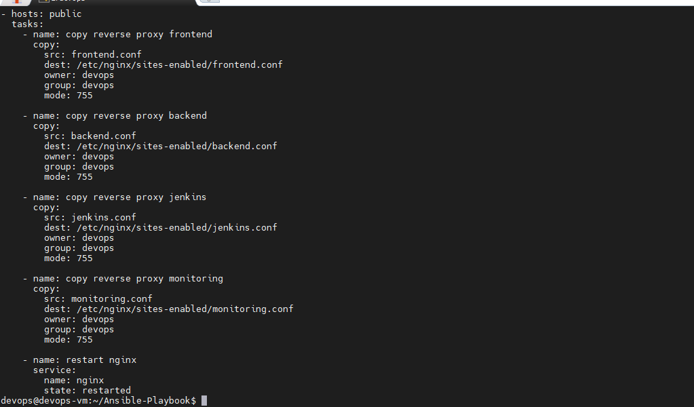
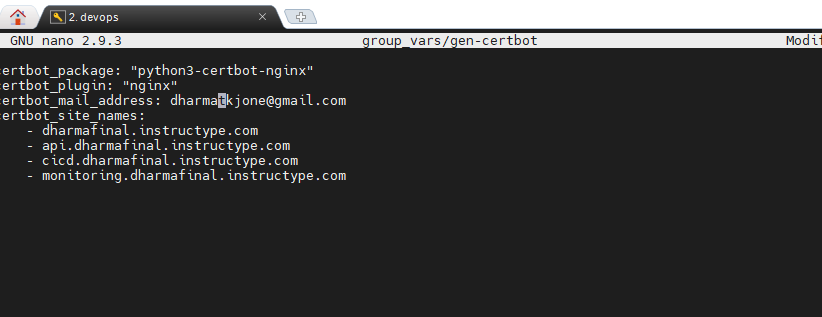
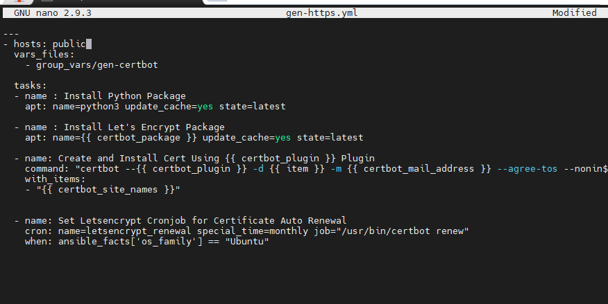
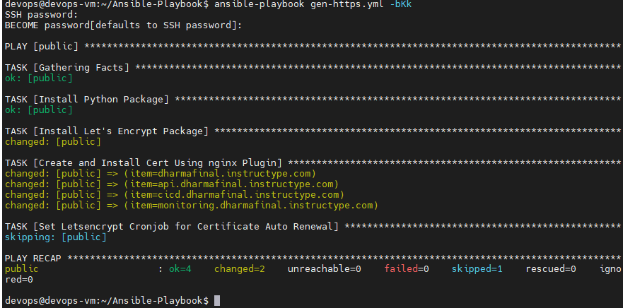
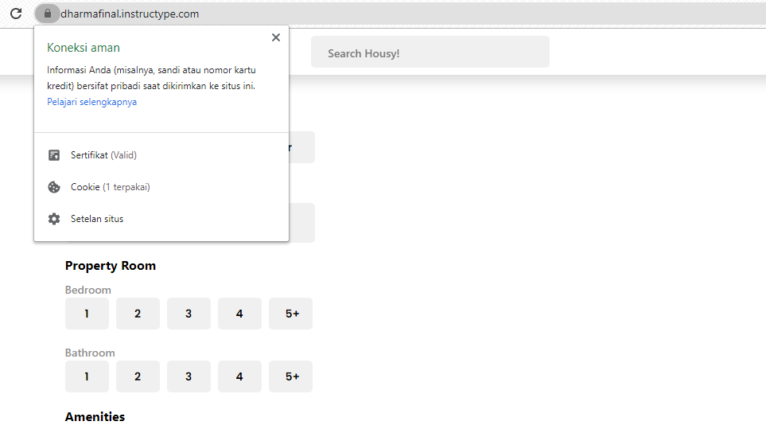
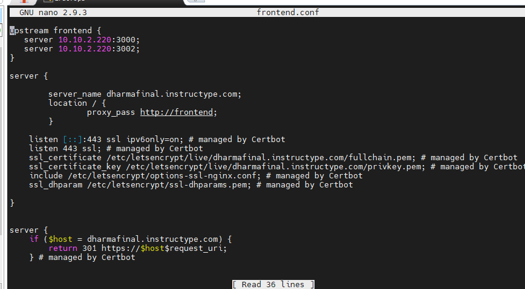

# WEB SERVER

- membuat file .yml untuk instalasi nginx dan dijalankan dari ansible

- Copykan file konfigurasi virtualhost dari ansible ke server public atau nginx

- Generate SSL dengan ansible.

- Maka virtualhost otomatis generate SSL

