# Create & Setup Server

## Konfigurasi Interface

#### Setup VPC dan Subnet Public dan Private
Amazon Virtual Private Cloud (Amazon VPC) memungkinkan Anda menyediakan bagian yang terisolasi secara logika pada AWS Cloud di mana Anda dapat meluncurkan sumber daya AWS pada jaringan virtual yang Anda tentukan.

- Hal yang dilakukan pertama adalah membuat VPC dengan range atau network ip yang sesuai kebutuhan.
    - Contoh :
        - VPC ip  10.200.0.0/16

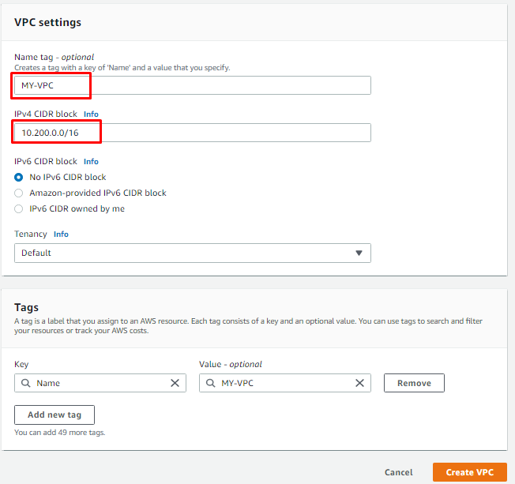

- Tentukan subnet untuk ip public dan private dengan IPv4 CIDRs yang sudah ditentukan
    - Contoh :
        - subnet ip public 10.200.0.0/24 
        - subnet ip private 10.200.1.0/24  

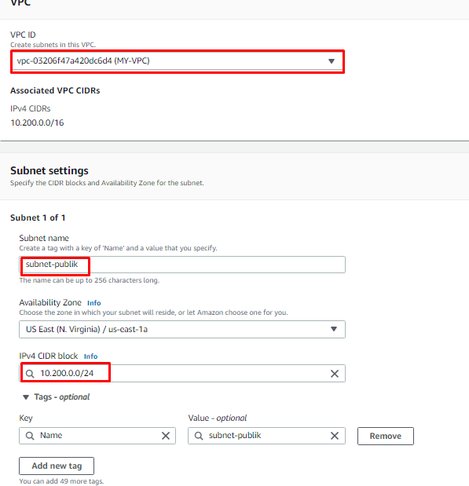

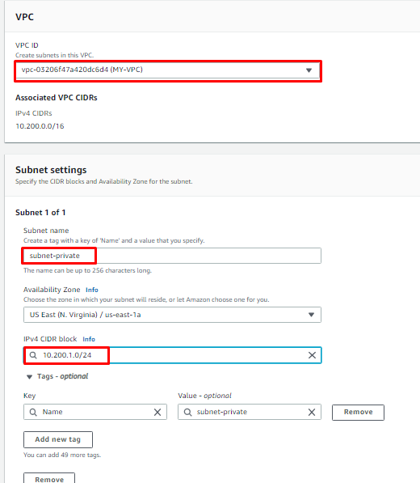

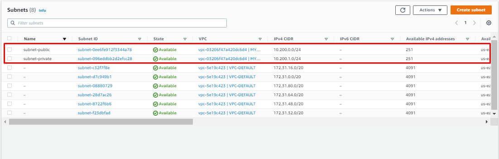

#### Setup Internet Gateway
Internet Gateway disini bertujuan untuk instance agar bisa berkomunikasi dengan instance yang lain atau satu jaringan komputer lain.
- Create Internet Gateway dan menambahkan tag sebagai identitas.

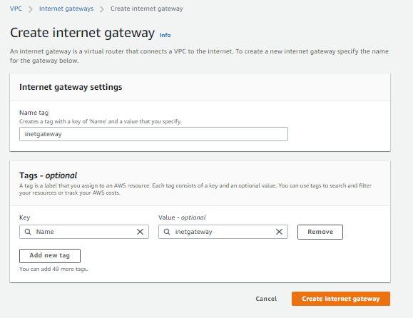

- Lakukan Attach to VPC untuk menginisialisasikan VPC yang dituju.
    - Contoh : VPC yang sudah dibuat sebelumnya (MY-VPC)

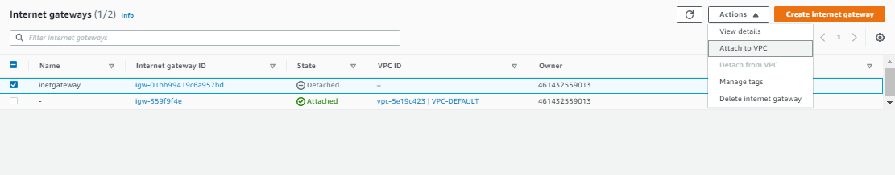

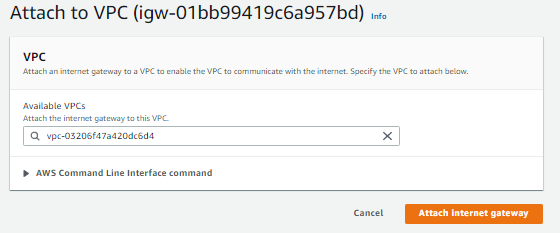

#### Setup Route Table Untuk Subnet Public dan Private
Route disini bertujuan untuk menghubungan jaringan yang berbeda yang dimana subnet dari ip public dapat terhubung ke internet melalui internet gateway dan subnet ip private dapat berkomunikasi ip private pada server public.

- Create route table dengan menambahkan name tag dan VPC.
    - Contoh : 
        - public-route-table
        - private-route-table

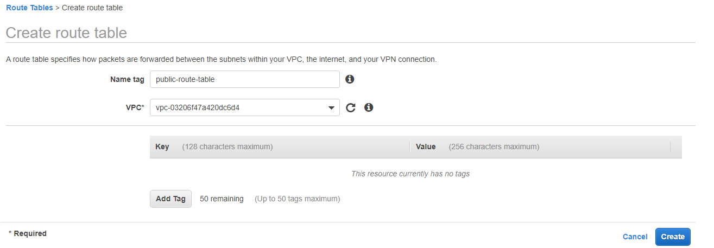

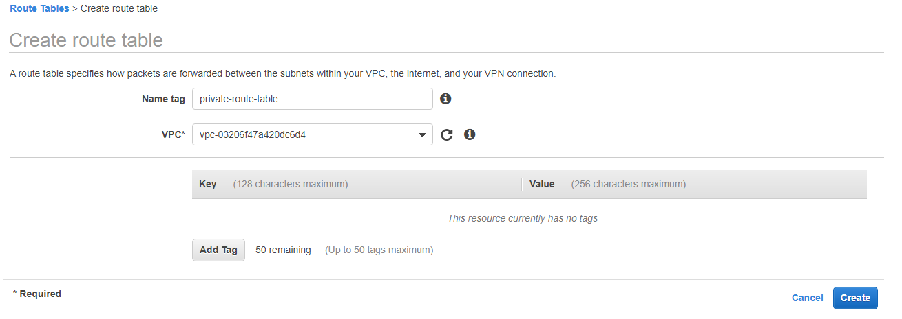

- Menambahkan masing-masing subnet pada setiap route table

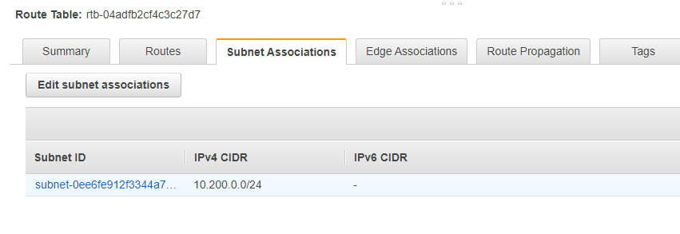

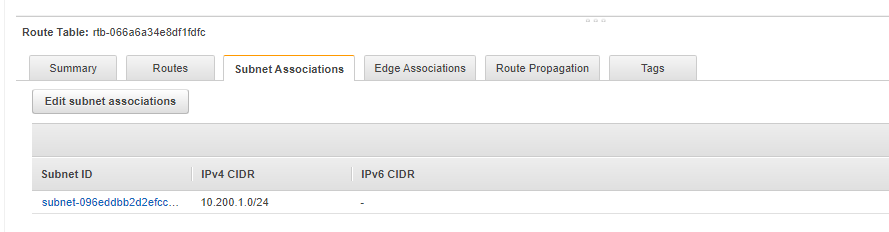

- Edit routing table pada public-route dan tambahkan dengan destination 0.0.0.0/0 atau internet dengan taget melalui internet gateway. Untuk private route dilakukan nanti pada tahap proses NAT Gateway.

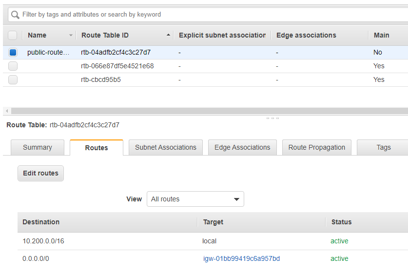

## Setup Instance Pada Server Public Untuk Reverse Proxy
Instance ini bertujuan sebagai perantara untuk aplikasi yang berjalan pada server private, dimana server public ini terdapat reverse proxy untuk aplikasi.

- Memilih OS yang akan digunakan untuk server, dalam hal ini menggunakan ubuntu server 18.0.4

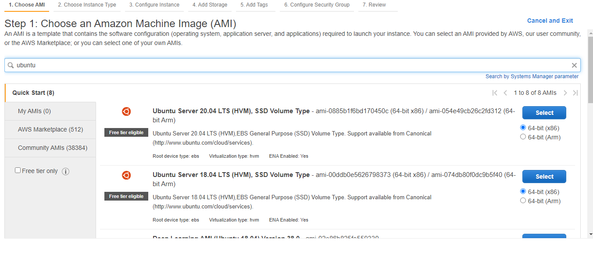

- Jenis instance yang akan digunakan untuk saat ini menggunakan type t2 micro dengan spesifikasi sesuai kebutuhan

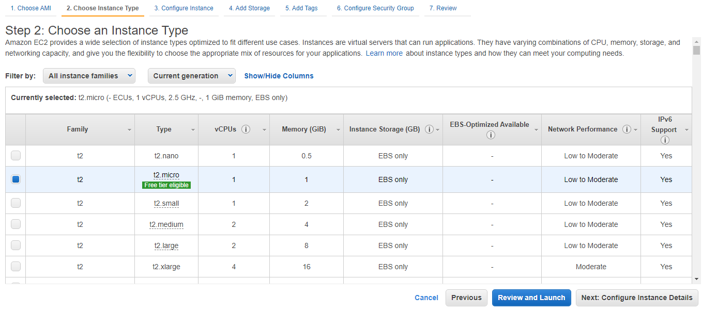

- Konfigurasi Instance dengan network sesuai VPC yang sudah dibuat, subnet menggunakan subnet-public dan Auto-assign Public IP dilakukan Disable dikarenakan untuk server menggunakan ip static yang akan dikonfigurasi melalui elastic ip, tidak disarankan menggunakan ip dinamis karena dalam proses pengembangan akan merepokan jika terjadi perubahan ip pada server. 

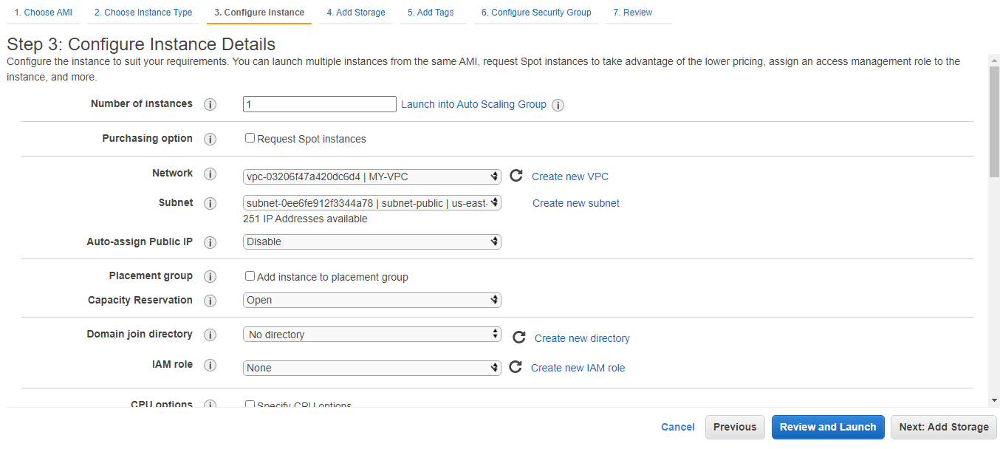

- Storage pada Instance yang digunakan menggunakan 8 GB sesuai kebutuhan.

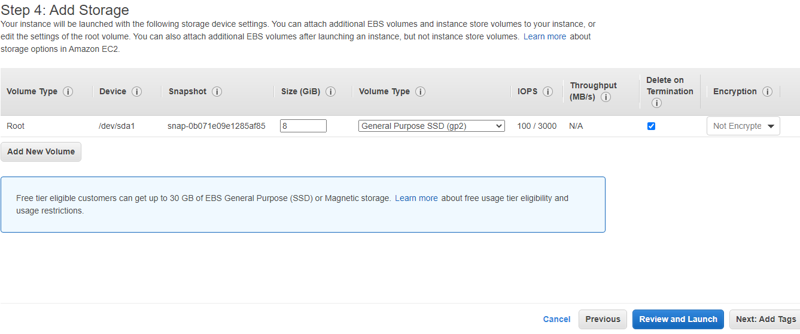

- Tambahkan tag untuk memberikan identitas pada instance

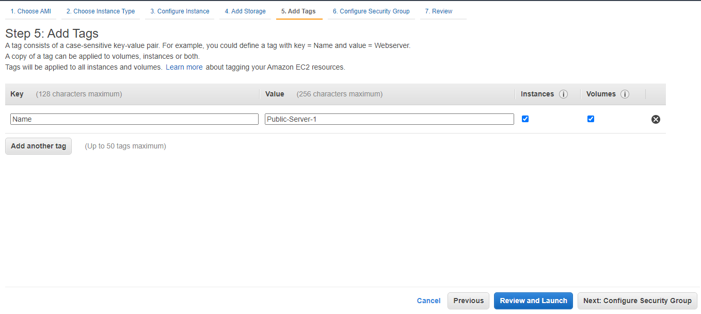

- Konfigurasi security group untuk memberikan layanan atau service apa saja yang bisa di akses, hal ini yang dibutuhkan adalah :
    - SSH   : server bisa diakses melalui komputer atau jaringan public (Port 22)
    - HTTP  : web dapat diakses secara public (Port 80)
    - HTTPS : web dapat diakses secara Secure atau SSL (Port 443)

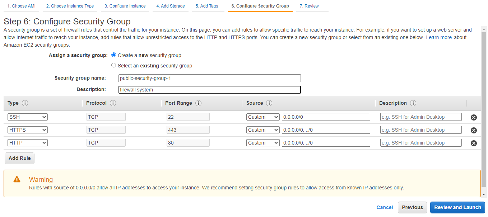

- Membuat keypair baru untuk login ke ssh server.

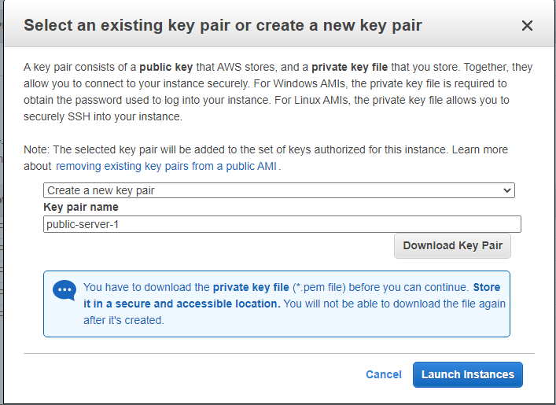

- Setelah proses installasi server selasi, maka langkah selanjutnya memberikan public ip static yang nantinya komputer atau host dapat mengakses server.

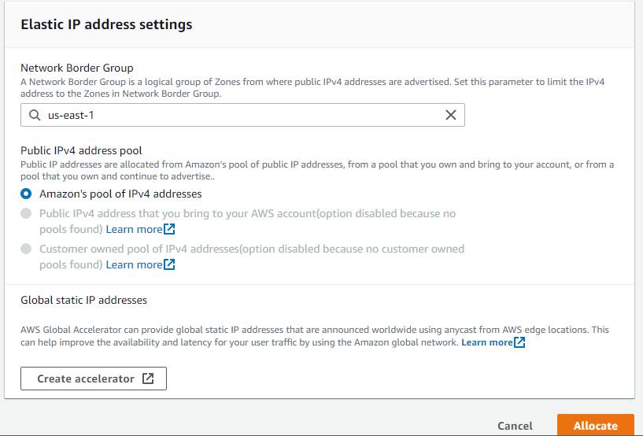

- Tambahkan elastic ip ke server public.

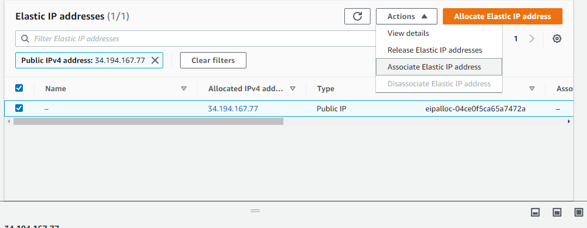

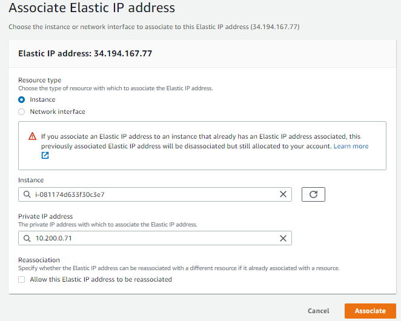

## Setup Instance Pada Server Private Untuk Aplikasi 
Pada Instance atau Server Private ini bertujuan untuk menjalankan aplikasi yang nantinya dapat diakses melalui jaringan public dengan perantara Proxy. Pada server private menggunakan ubuntu server 18.04 hal sama dilakukan pada saat membuat instance server public, namun yang membedakan adalah Configure instance dan Security Group.

- Konfigurasi Instance dengan network menggunakan VPC yang sudah dibuat, subnet menggunakan subnet untuk server private dan Auto-assign Public IP disable, karena tidak memerlukan ip public pada private server.

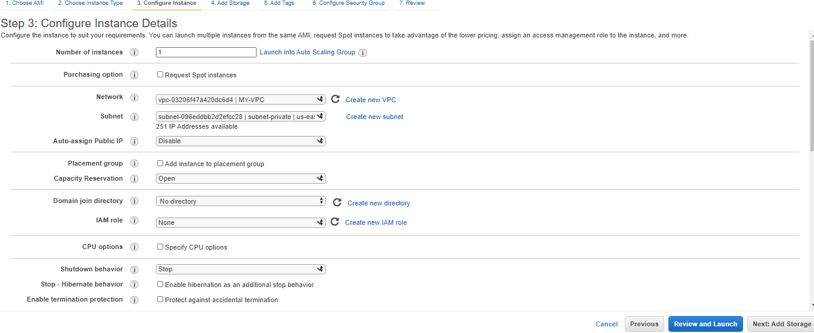

- Konfigurasi security Group agar server public dapat menggunakan service dari server private.

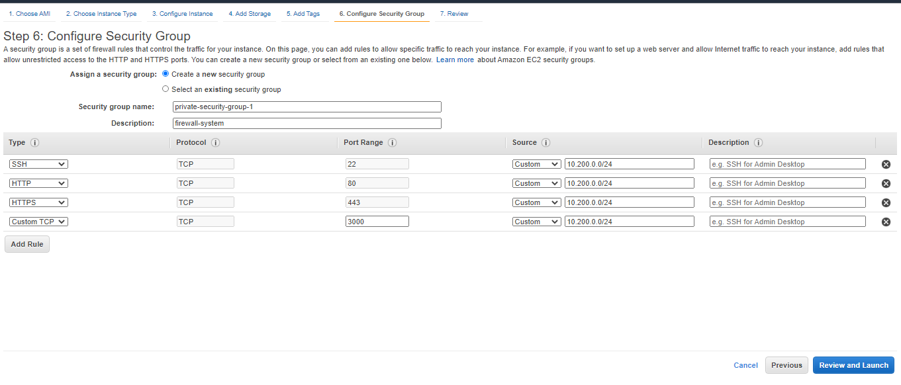

- Menggunakan ssh key sebelumnya.

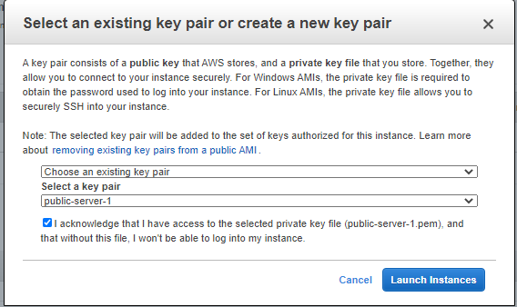

## SSH Pada Server Public

## SSH Pada Server Private Melalui Server Public

## NAT Gateway