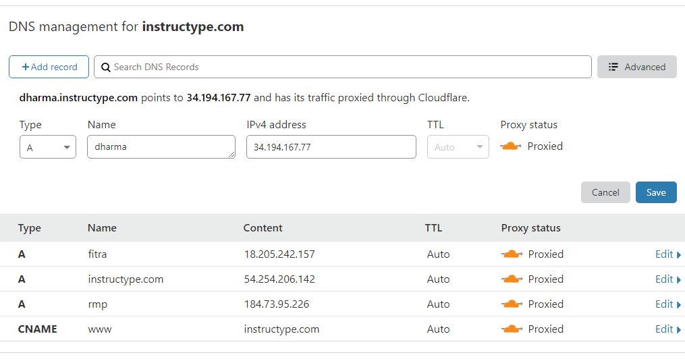
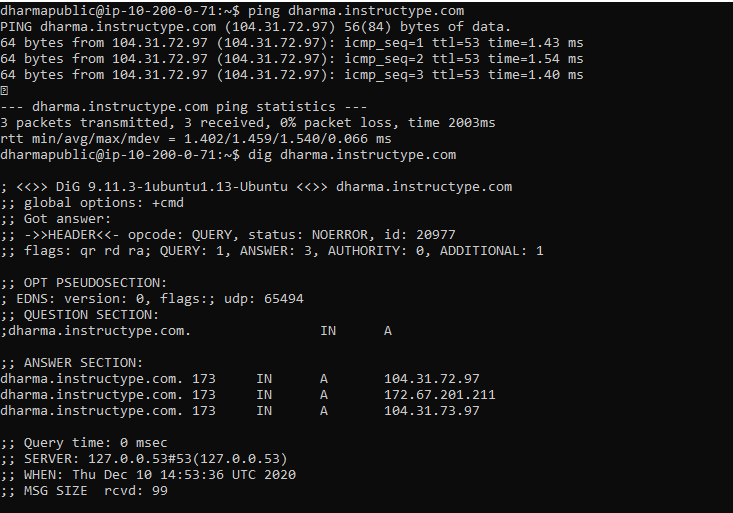

# Custome Domain dengan Cloudfare
DNS adalah memetakan nama domain ke alamat IP host.
- Tambahkan dns dari cloudfare dengan memasukan sub-domain dan elastic ip dari server public. Piliy type A berfungsi untuk memetakan  domain atau subdomain ke IPv4 yang tercantum di dalamnya.

- Pengujian dengan melakukan ping dan dig (untuk mendapatkan informasi tentang DNS name server)

