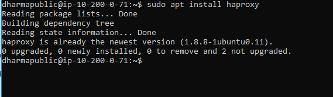
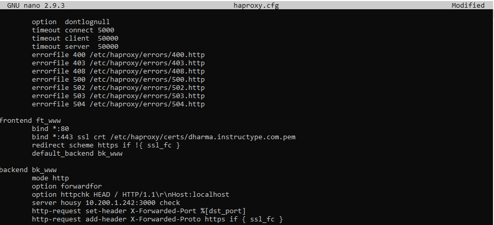
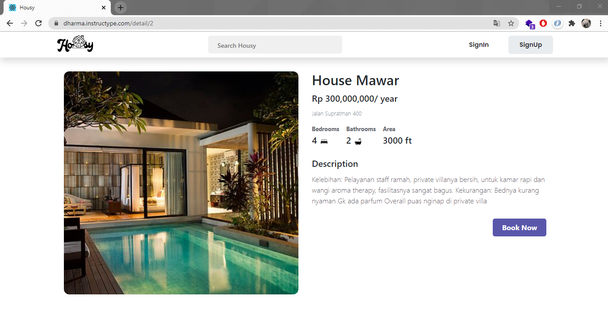
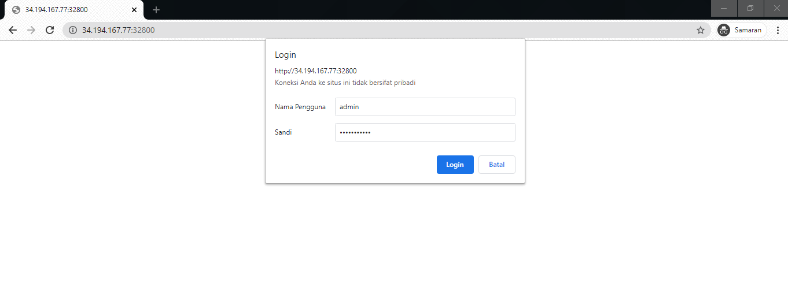
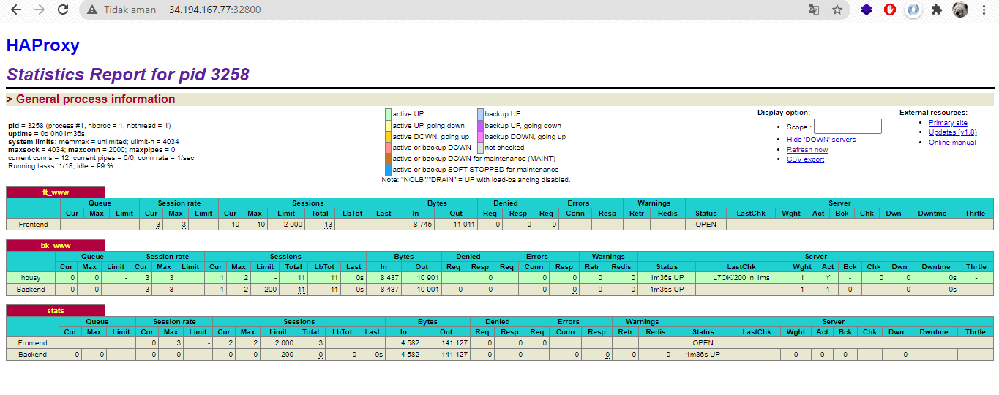

# REVERSE PROXY DENGAN NGINX PADA SERVER PUBLIC
bertindak sebagai penghubung antara host (client) dan server. Reverse proxy membawa request client dan menyalurkannya ke server lain Akhirnya, mengantarkan respon server pada client, seolah muncul dari proxy server itu sendiri.

- Melakukan update dan upgrade pada sistem operasi ubuntu server dan menginstall aplikasi nginx untuk reverse proxy


- Ketika sudah install aplikasi nginx, testing melalui browser client untuk melihat halaman website nginx.


- Konfigurasi file .conf pada directory /etc/nginx/site-available/ dengan nama file proxy_app.conf


- Setelah itu lakukan link file pada directory /etc/nginx/site-enabled untuk mengaktifkan konfigurasi .conf pada nginx. Untuk directory /etc/nginx/site-enabled default terkonfigurasi pada /etc/nginx.conf sehingga kita perlu menjalankan perintah ln -s /etc/nginx/site-available/proxy_app.conf /etc/nginx/site-enabled/proxy_app.conf


- Pengujian pada web browser dengan mengetikan domain yang sudah terdaftar di cloudfare dengan domain dharma.instructype.com.


# REVERSE PROXY DENGAN HAPROXY PADA SERVER PUBLIC
Pada kasus ini mencoba untuk explore terkait tool Haproxy yang berfungsi untuk reverse proxy sehingga dapat dijadikan alternatif selain menggunakan nginx, pada Haproxy juga terdapat monitoring tools atau menampilkan report.

- Langkah pertama install terlebih dahulu aplikasi Haproxy pada Ubuntu Server Public.



- Membuat directory untuk menempatkan certificate ssl yang sudah dibuat pada dokumentasi AWS - SSL Configuration
    ```
    sudo mkdir -p /etc/haproxy/certs
    ```
- Menggabungkan certificate yang sudah dibuat dengan certbot kedalam sebuah file, yang berfungsi untuk mengarahkan proxy ke https dan memberikan permission untuk mengamankan hak akses dikarenakan terdapat private key.
    ```
    DOMAIN='dharma.instructype.com' sudo -E bash -c 'cat /etc/letsencrypt/live/$DOMAIN/fullchain.pem /etc/letsencrypt/live/$DOMAIN/privkey.pem > /etc/haproxy/certs/$DOMAIN.pem'

    sudo chmod -R go-rwx /etc/haproxy/certs
    ```
- Tambahkan konfigurasi untuk melakukan reverse proxy pada file /etc/haproxy/haproxy.cfg
dan lalkukan sudo systemctl restart haproxy, lalu lakukan akses pada website dengan mengetikan domain pada web browser client.





- Tambahkan konfigurasi untuk menampilkan statistic report atau log Haproxy pada /etc/haproxy/haproxy.cfg, dan open port 32800 pada security group AWS.

    ```
    listen stats
        bind :32800
        stats enable
        stats uri /
        stats hide-version
        stats auth admin:password123
    ```

- Selanjutnya akses menggunakan ip public dengan port yang sudah ditentukan.



