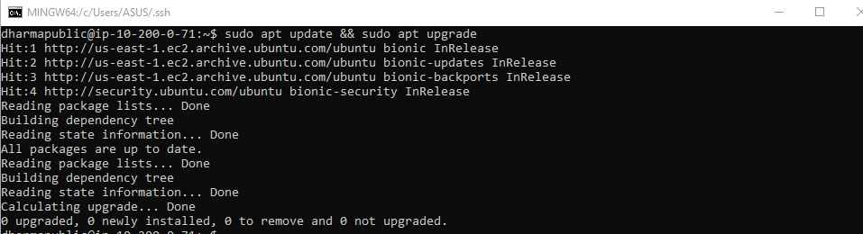
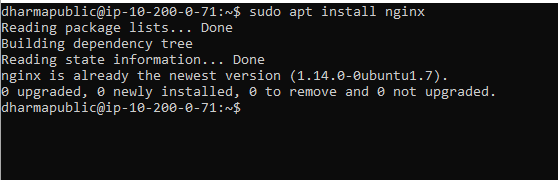
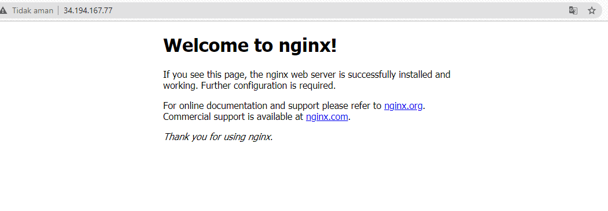
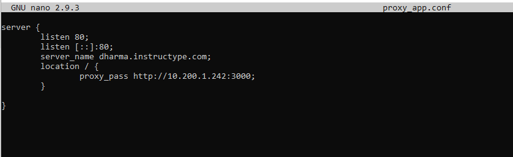
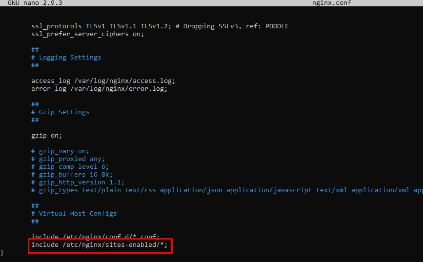
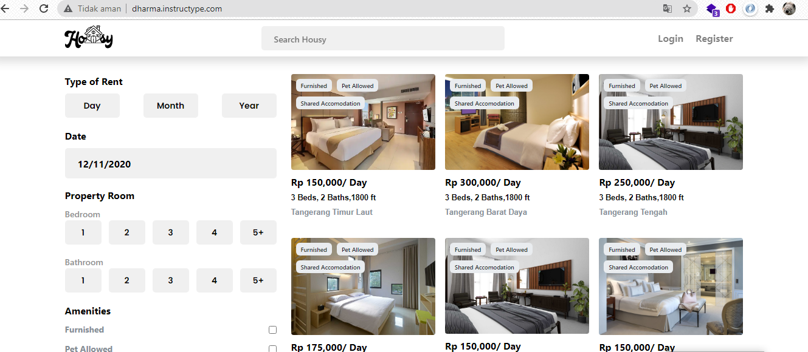

# REVERSE PROXY PADA SERVER PUBLIC
bertindak sebagai penghubung antara host (client) dan server. Reverse proxy membawa request client dan menyalurkannya ke server lain Akhirnya, mengantarkan respon server pada client, seolah muncul dari proxy server itu sendiri.

- Melakukan update dan upgrade pada sistem operasi ubuntu server dan menginstall aplikasi nginx untuk reverse proxy

- Ketika sudah install aplikasi nginx, testing melalui browser client untuk melihat halaman website nginx.

- Konfigurasi file .conf pada directory /etc/nginx/site-available/ dengan nama file proxy_app.conf

- Setelah itu lakukan link file pada directory /etc/nginx/site-enabled untuk mengaktifkan konfigurasi .conf pada nginx. Untuk directory /etc/nginx/site-enabled default terkonfigurasi pada /etc/nginx.conf sehingga kita perlu menjalankan perintah ln -s /etc/nginx/site-available/proxy_app.conf /etc/nginx/site-enabled/proxy_app.conf

- Pengujian pada web browser dengan mengetikan domain yang sudah terdaftar di cloudfare dengan domain dharma.instructype.com.

