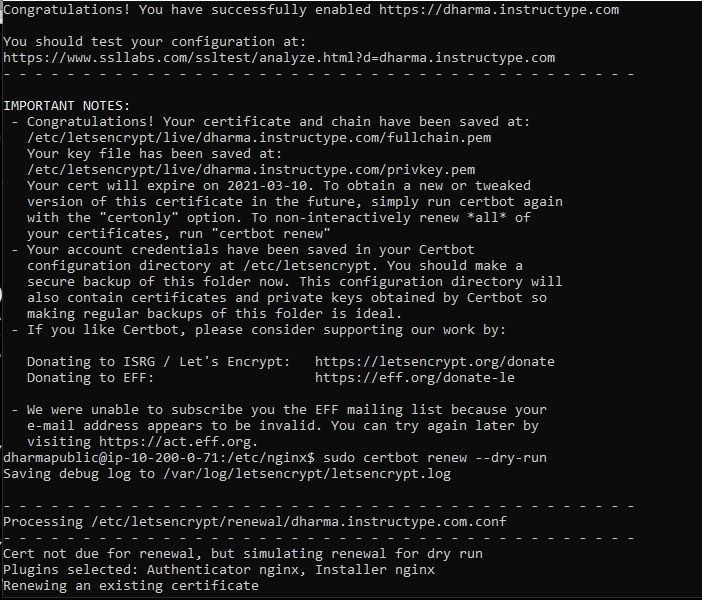
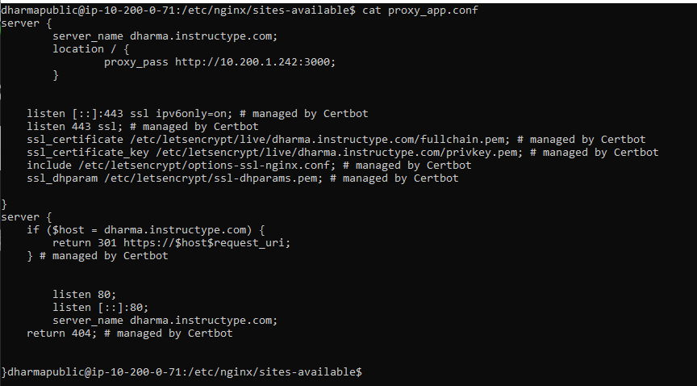
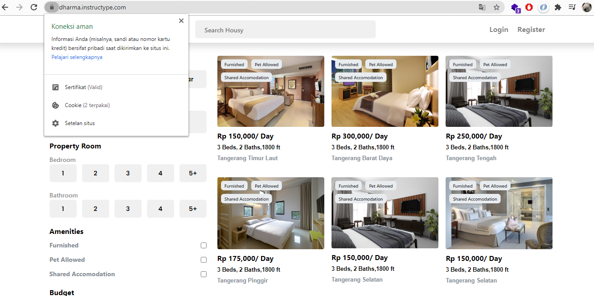

# MENAMBAHKAN SSL LET'S ENCRYPT
HTTPS merupakan Enkripsi yang dilakukan pada data session, selain menggunakan komunikasi plain text. Proses enkripsi ini menggunakan protokol SSL (Secure Socket layer) atau protokol TLS (Transport Layer Security). Karena menggunakan protokol ini, umumnya port untuk HTTPS adalah 443

- Menginstal aplikasi certbot dengan beberapa perintah berikut pada server public

```
sudo apt-get update
sudo apt-get install software-properties-common
sudo add-apt-repository universe
sudo add-apt-repository ppa:certbot/certbot
sudo apt-get update
sudo apt-get install certbot python-certbot-nginx
```

- Setup certificates dan konversi virtual host ke HTTPS

```
sudo certbot --nginx
```



- Cek Konfigurasi virtual host proxy_app.conf pada /etc/nginx/site-available.



- Hasil konfigurasi https pada nginx dengan certbot

