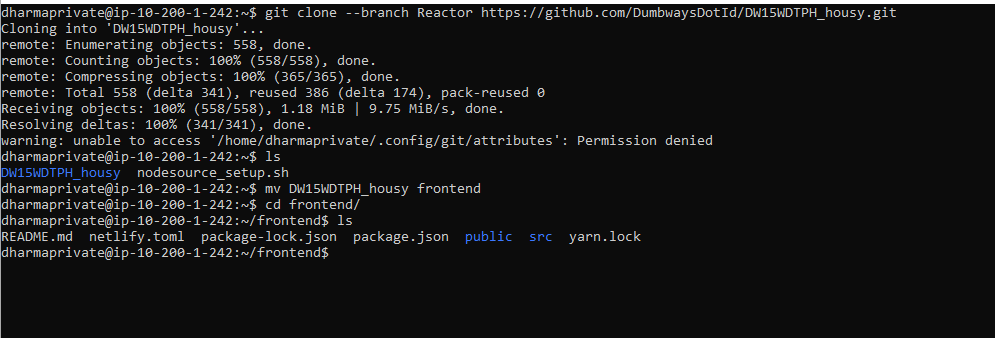

# Deploy Aplikasi Pada Server Private

- Setelah menjalankan SSH dari Server Public hal yang dilakukan adalah:

	- Mengupdate dan upgrade apt dengan perintah `apt update && apt upgrade`
	- Install nodejs menggunakan PPA dengan perintah 
	
	```
	curl -sL https://deb.nodesource.com/setup_10.x -o nodesource_setup.sh
	sudo bash nodesource_setup.sh
    sudo apt install nodejs
    node -v
	```
    - install pm2 dengan menggunakan perintah

    ```
    sudo npm install pm2 -g
    ```
- Melalukan clone repository atau project aplikasi yang akan dideploy dan npm install terhadap dependencies package.json.




- Membuat file ecosystem.config.js pada folder aplikasi, untuk menjalankan aplikasi secara background dengan pm2 dan jalankan perintah pm2 start


