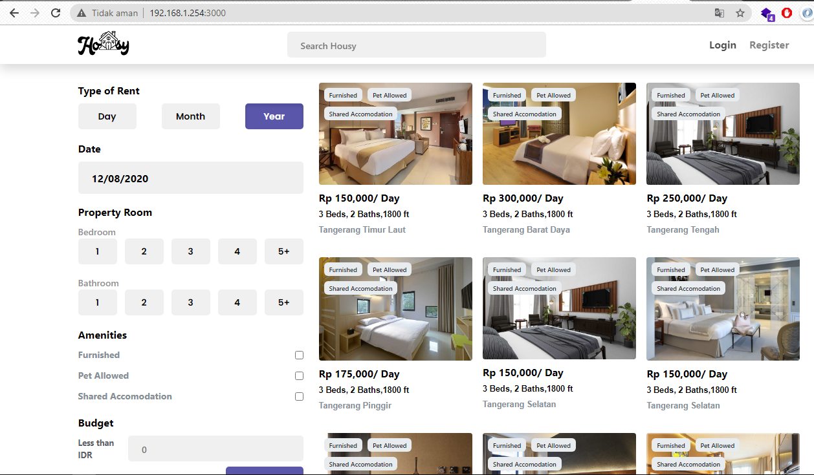

# Instalasi WEB Server dengan NGINX dan Deploy Aplikasi NodeJS

## Instalasi Nginx
1. Hal pertama yang dilakukan adalah melakukan update terhadap repository ubuntu untuk menginstall aplikasi yang diperlukan.

2. Install packet aplikasi nginx.

3. Ketika install nginx sudah selesai, lakukan pengecekan (status) terhadap aplikasi.

4. Selanjutkan jalankan web server dengan ip static yang sudah di konfigurasi.

## Deploy aplikasi NodeJS
1. Hal pertama yang dilakukan adalah download repository nodejs dengan menggunakan versi 10 (https://github.com/nodesource/distributions).

2. Selanjutnya install aplikasi nodejs.

3. Clone repository project yang sudah disediakan.

4. Masuk kedalam directory project aplikasi dan lakukan npm install pada file package.json untuk meinstall dependencies yang diperlukan

5. Jalankan aplikasi dengan perintah npm start 

6. Lakukan pengujian pada browser dengan alamat ip address statik dan port 3000 (sesuai dengan aplikasi).

