# Instalasi Ubuntu Server 18.04 pada VMWare Workstation 15
## Setup pada VMWARE
1. Membuat virtual machine baru dengan typical (recomended)

2. Pilih iso sesuai lokasi file anda (ubuntu server 18.04)

3. Setting account user pada sistem operasi

4. Letakan lokasi install virtual machine atau vmdk pada directory anda

5. Setting size harddisk (20 GB)

6. Klik Finish

7. Edit Virtual Machine Setting

8. Remove CD/DVD dan Floppy autoinst (supaya tidak melakukan auto install)

## Installasi Sistem Operasi Ubuntu
1. Pilih Bahasa dan Keyboard Layout

2. Settup interface sesuai dengan adapter yang digunakan
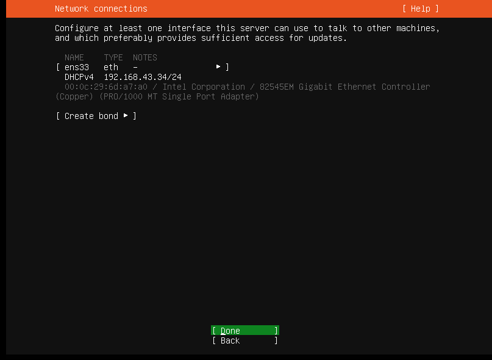
3. setup proxy (kosongkan)
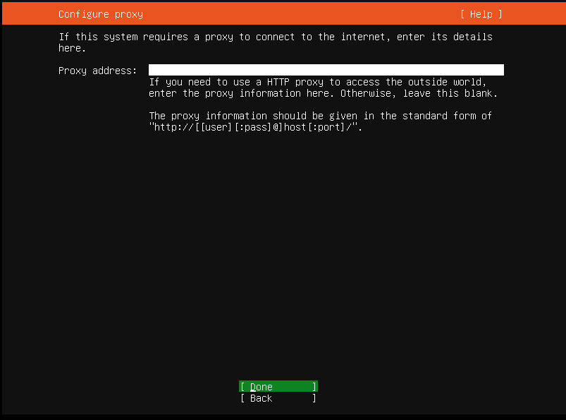

4. Pilih mirror address

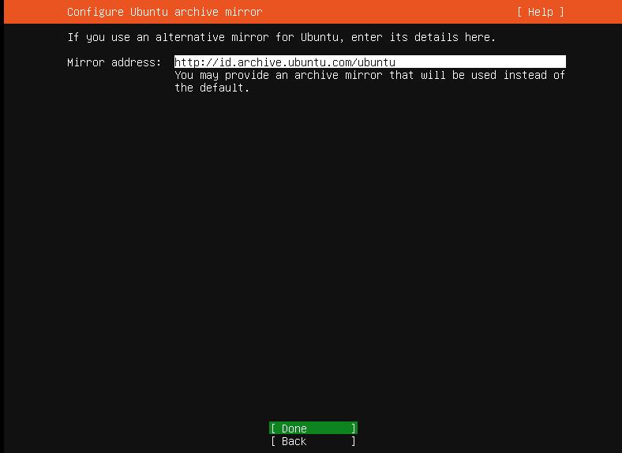 

5. Pilih Continue without updating

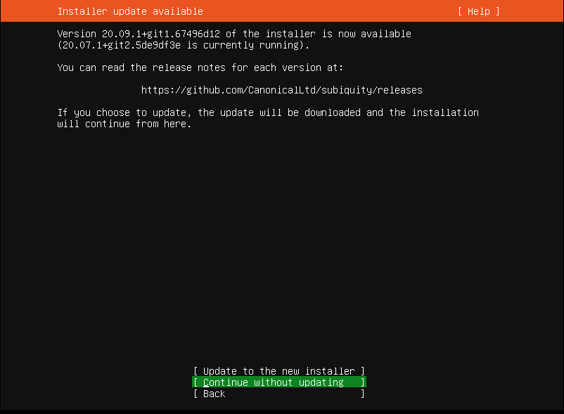

6. Pilih Custom Storage Layout

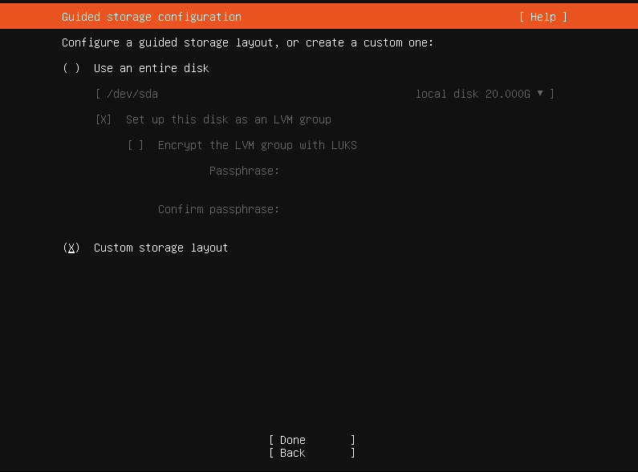

7. Settup partisi swap 4G sesuai dengan 2x jumlah memory (RAM)

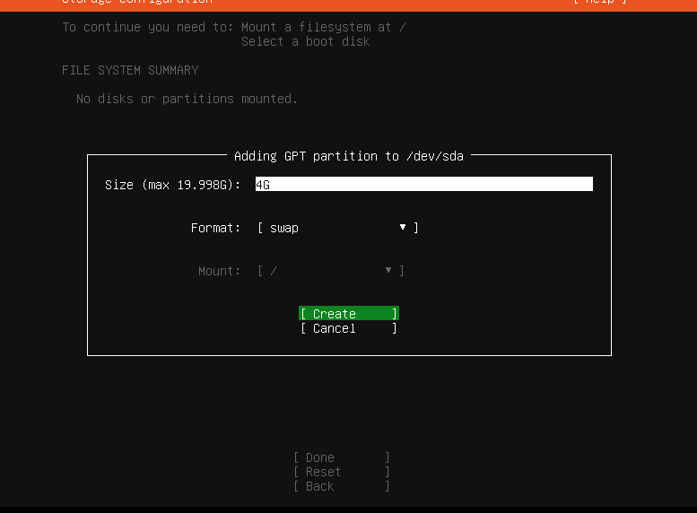

8. Settup partisi untuk system / dengan size 15.997G

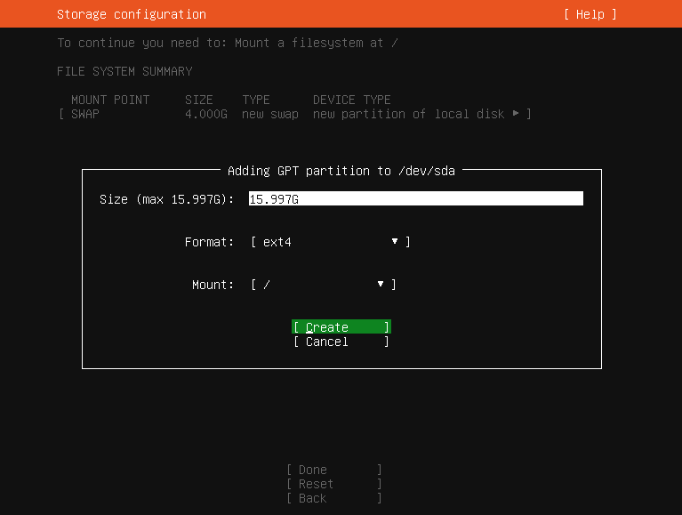

9. Pilih Done

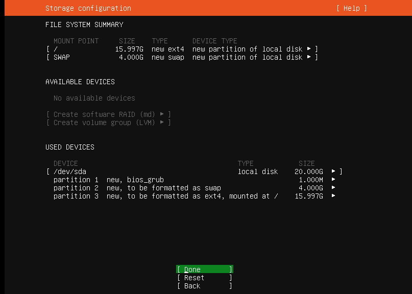

10. Setting profile account untuk sistem operasi ubuntu server

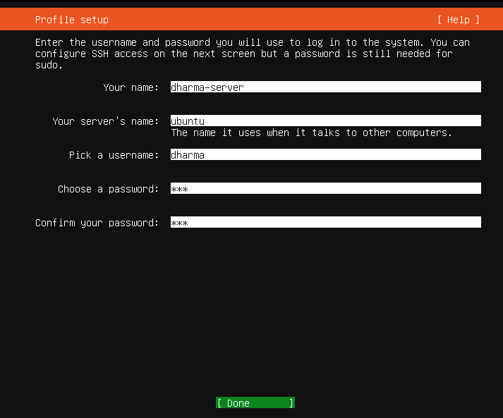

11. Uncheck openssh-server dikarenakan proses install ssh dilakukan manual, tekan done

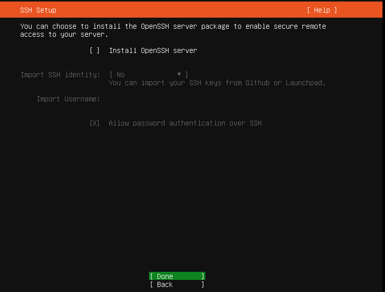

12. Proses Installasi selesai
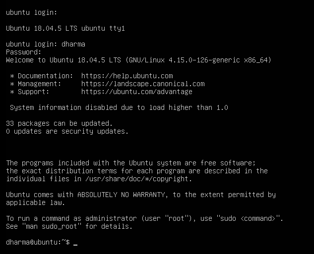