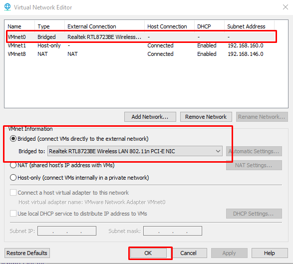
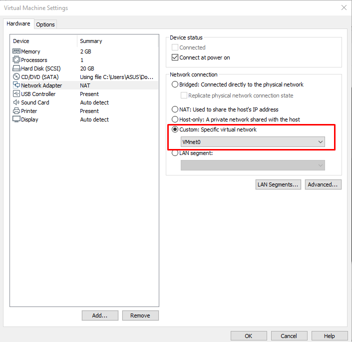
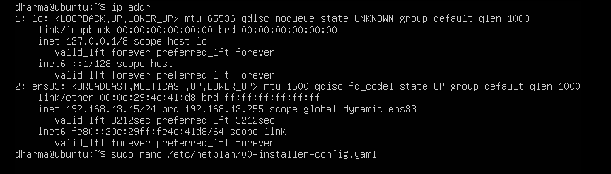
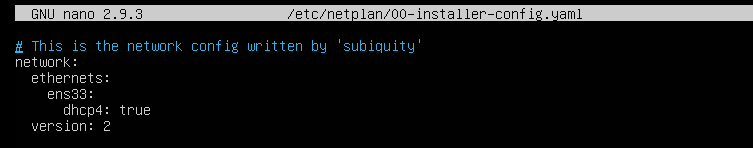
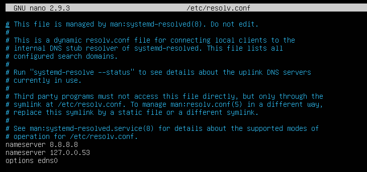
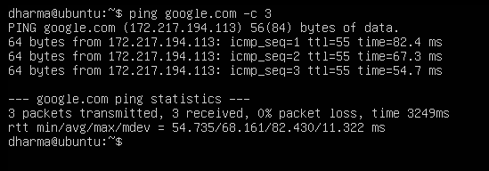

# Konfigurasi Network pada Ubuntu Server 18.04  VMWARE Workstation 15
1. Pilih Menu Edit > Virtual Network Editor

2. Lalu pilih VMnet0 dengan type Bridge menuju interface pada laptop, sehingga ubuntu pada vmware memiiki jaringan yang sama pada host di laptop

3. Setting Network Adapter dengan VMnet0

4. Konfigurasi DHCP pada network interface 

5. File dari konfigurasi

6. Memberikan DNS Server internet supaya server dapat terhubung ke public network

7. Pengujian dengan melakukan Ping google.com

