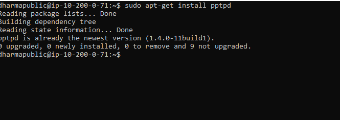
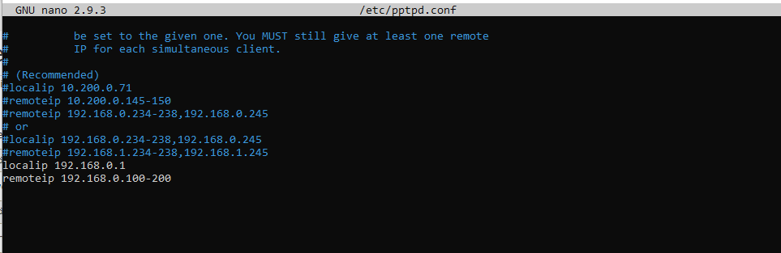
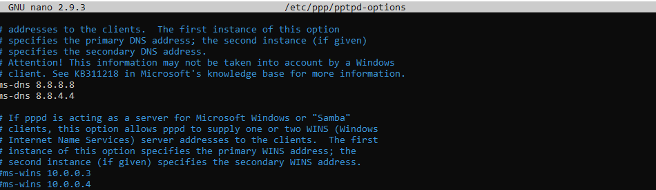
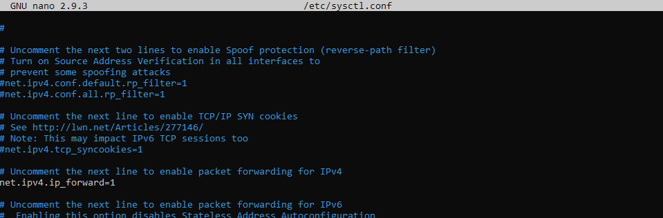
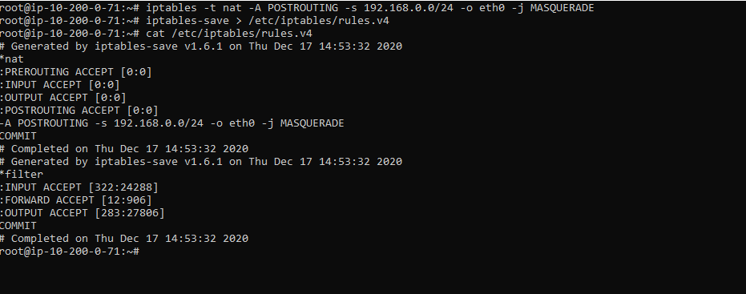
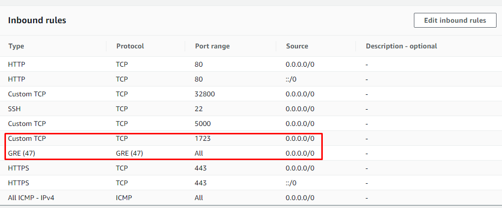
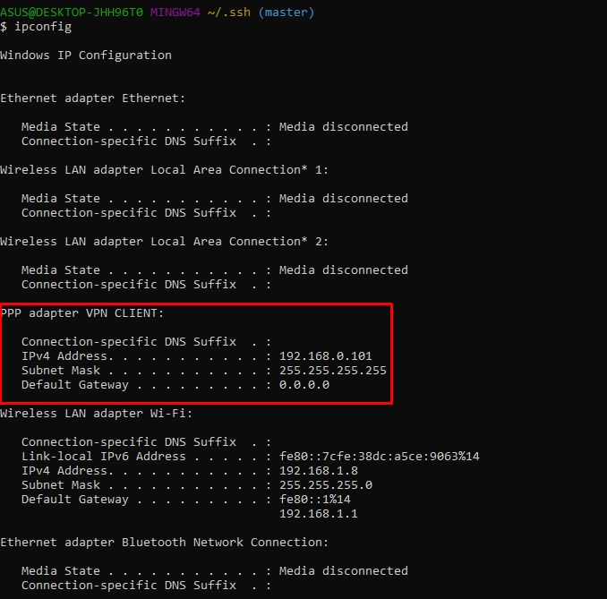
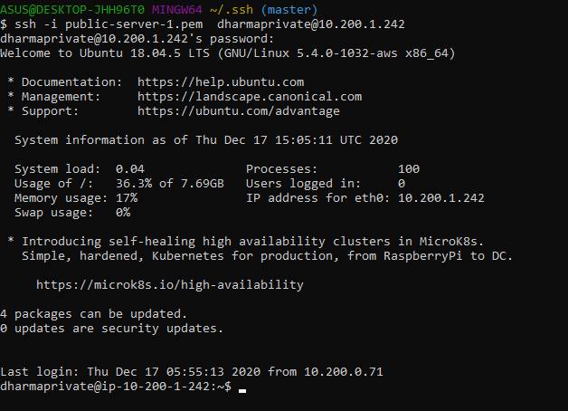

# VPN SERVER CONFIGURATION

- Pada Konfigurasi VPN server kita letakan pada server public dan menginstall aplikasi pptp sebagai server VPN.

- Konfigurasi file pptpd.conf dengan memberikan local ip  dan remote ip yang dimana berfungsi sebagai ip address pada suatu jaringan VPN.

- Selanjutnya edit file /etc/ppp/pptpd-options dengan memberikan dns agar bisa terhubung internet.

- Pembuatan user untuk VPN Client dilakukan pada file /etc/ppp/chap-screts

# IPTABLE CONFIGURATION

- Konfigurasi ini berfungsi untuk melakukan forwarding terhadap ip vpn sehingga dapat meangkses server dan internet. Hal yang dikonfigurasi adalah file /etc/sysctl.conf dan lakukan seperti gambar berikut.

- Tambahkan konfigurasi NAT pada server public dengan perintah `iptables -t nat -A POSTROUTING -s 192.168.0.0/24 -o eth0 -j MASQUERADE` lalu save iptable agar ketika proses reboot konfigurasi iptable tidak terhapus dengan perintah `iptables-save > /etc/iptables/rules.v4` jika tidak bisa melakukan save, maka perlu install `sudo apt-get install iptables-persistent`.

# VPN CLIENT CONFIGURATION

- Pada saat ini melakukan proses VPN Client melalui Windows 10, hal yang dilakukan adalah masuk kedalam konfigurasi netowrk dan pilih bagian tambah vpn, lalu isikan servername, username, dan password yang sudah dikonfigurasi sebelumnya.

- Untuk security group pada public server perlu open port 1723 untuk vpn pptp dan IP Protocol 47/GRE untuk enkapsulasi paket datanya.

- Ketika sudah terhubung dengan VPN Server maka kita cek ip yang didapatkan.

- Pengujian dengan melakukan ssh pada ip private server.

