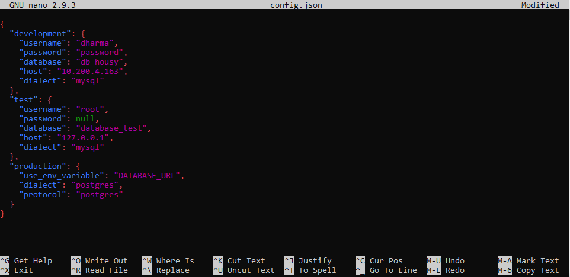
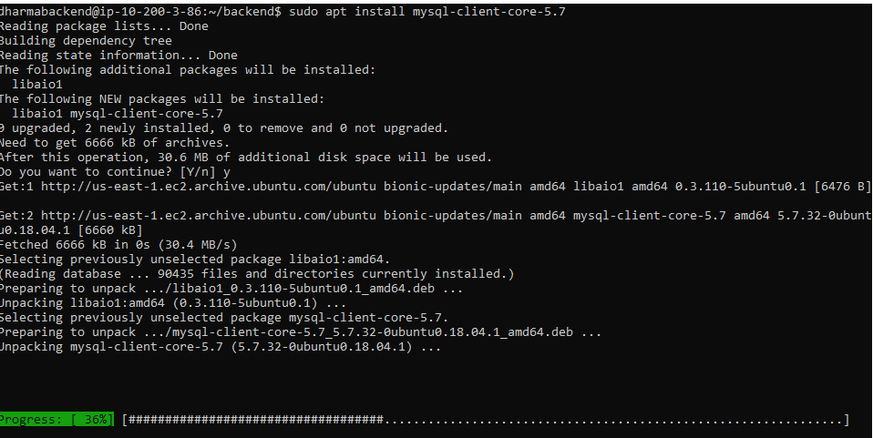
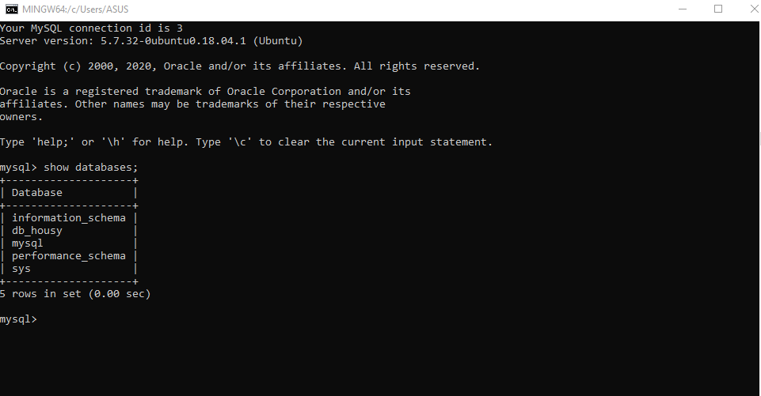
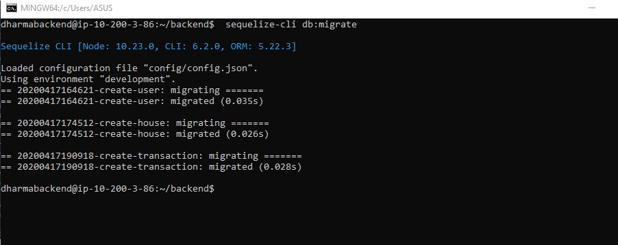
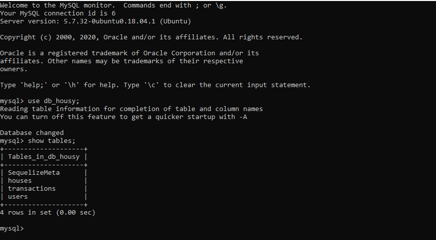
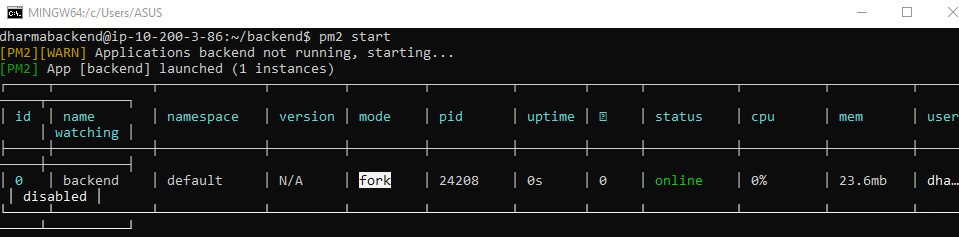

# DEPLOYMENT BACKEND APPLICATION FOR API

- Clone repository dari 'git@github.com:igstbagusdharmaputra/housy-backend.git' dan mengubah nama directory menjadi backend lalu masuk ke directory tersebut untuk melakukan install dependency package dengan perintah `npm install`.

- Install library pendukung untuk memudahkan dalam proses development, dengan menginstall pm2 dan install sequelize untuk migrasi database sehingga dapat mengetikan perintah `sudo npm install -g sequelize-cli`

- Edit file config.json pada directory backend/config mengubah parameter dari object development denga menggantikan isi username,password,database dan host sesuai dengan konfigurasi yang ada pada Setup Database.

- Sebelum melakukan proses migrasi, tahap selanjutnya melakukan remote ke database server dengan cara menginstall mysql client pada server backend dapat mengetikan perintah `sudo apt install mysql-client-core-5.7`

- Selanjutnya melakukan remote dengan perintah `mysql -u username -h ip-server-db -p` ketika sudah berhasil login maka user dapat mengoperasikan database seperti menampilkan database dengan perintah `show databases;`

- Jalankan proses migrasi database pada directory project dengan perintah `sequelize-cli db:migrate`

- Pengecekan pada proses migrasi dengan melihat isi table dari databse dapat dilakukan dengan perintah yaitu `use nama_database;` berfungsi untuk penggunaan database dan `show tables;` untuk menampilkan isi table dari database.

- Jalankan aplikasi dengan menggunakan pm2 agar bisa berjalan di background.

