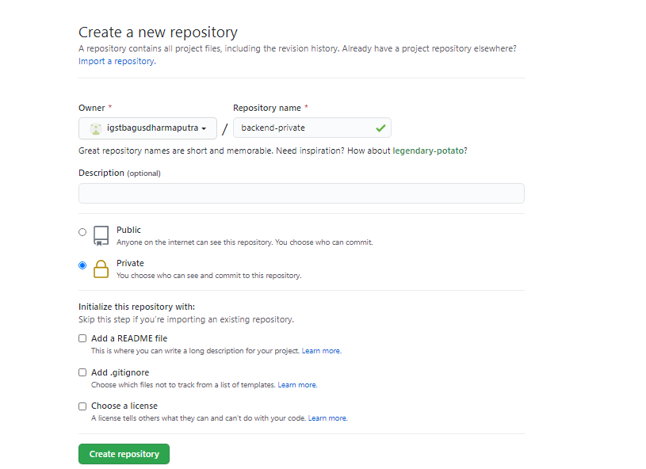

# INSTALL GIT AND SSH KEY

- Fork Repositoy pada project mas sugeng `https://github.com/sgnd/housy-backend` sehingga kita mendapatkan salinan dari repo tesebut tanpa perlu mengcopy secara manual, dengan menggunakan fork kita dapat mengupdate repositori master atau repository yang kita fork.

- Membuat repository private pada frontend dan backend untuk menampung project

- Selanjutnya membuat SSH Keygen dengan perintah `ssh-keygen -t rsa -b 4096`

- Lihat isi file dari id_rsa.pub yang berisikan key, untuk digunakan pada github SSH key dengan perintah `cat ~/.ssh/id_rsa.pub`, kemudian tambahkan ke akun github dengan perintah `ssh -T git@github` untuk menghubungkan dengan komputer dan github yang sudah berisikan SSH.

- Clone repository public dan mengubah nama project menjadi backend dengan perintah `mv`.

- Selanjutnya kita mencoba push ke repository private dan juga melakukan beberapa perubahan pada file config.json.

- Untuk frontend dapat melakukan hal yang sama untuk proses git dan ssh key.

