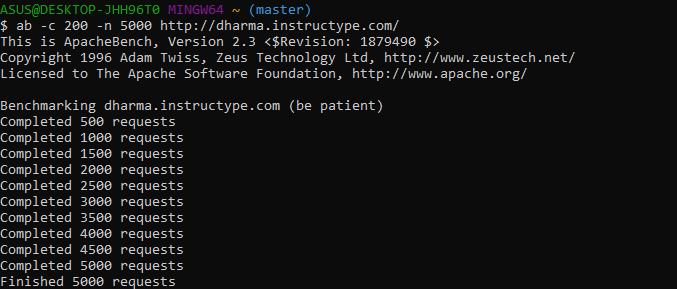
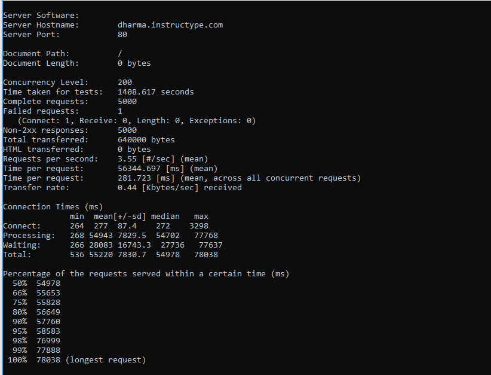
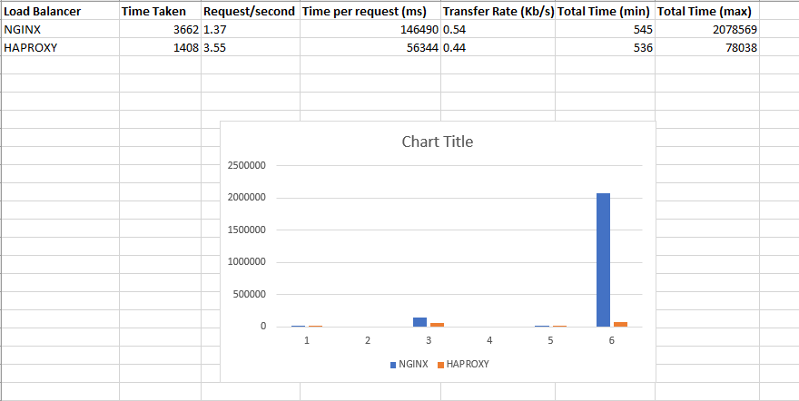

# NGINX VS HAPROXY

- Dalam pengujian menggunakan tool Apache Benchmarking yang dilakukan pada client windows 

- Berikut hasil yang sudah dilakukan ketika melakukan benchmarking pada loadbalancing nginx dan haproxy

- Hasil dengan statistik yang sudah dibuat maka secara keseluruhan Haproxy lebih baik untuk menangani 5000 request

