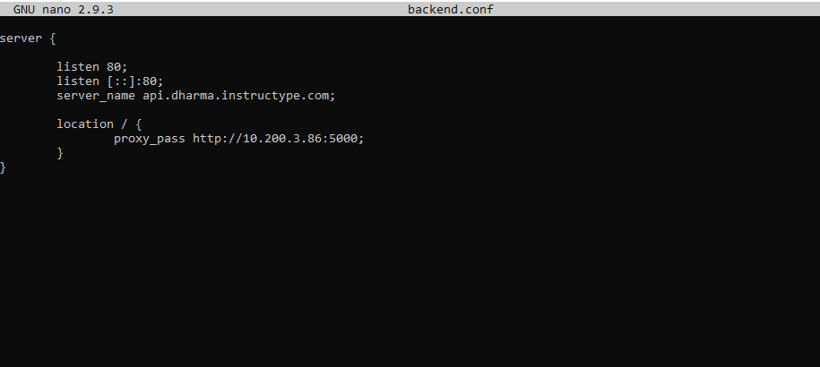
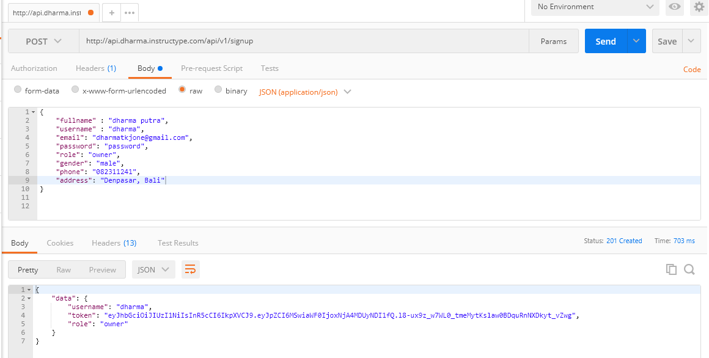
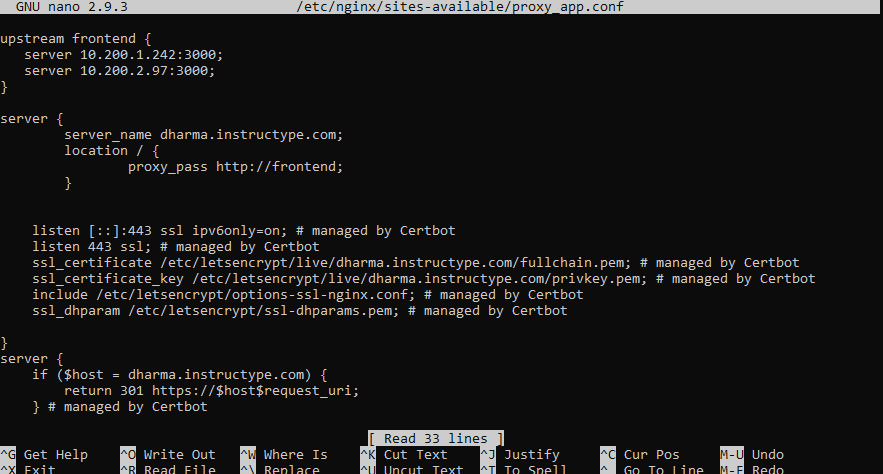

# REVERSE PROXY

- Membuat file virtualhost bernama backend.conf dan masukan konfigurasi seperti gambar berikut. Untuk file konfigurasi bisa digabungkan dengan virtualhost frontend, tapi untuk saat ini dilakukan terpisah agar mudah dalam proses debuging atau memperbaiki ketika ada error.

- Selanjutnya mencoba membuat user dengan POSTMAN melalui endpoint API `http://api.dharma.instructype.com/api/v1/signup` backend yang sudah terdeploy.

- Pada frontend kita lakukan proses Load Balancing dengan metode round robin terhadap 2 server frontend, sehingga ketika salah satu server down maka server yang lain akan menggantikan server tersebut.

