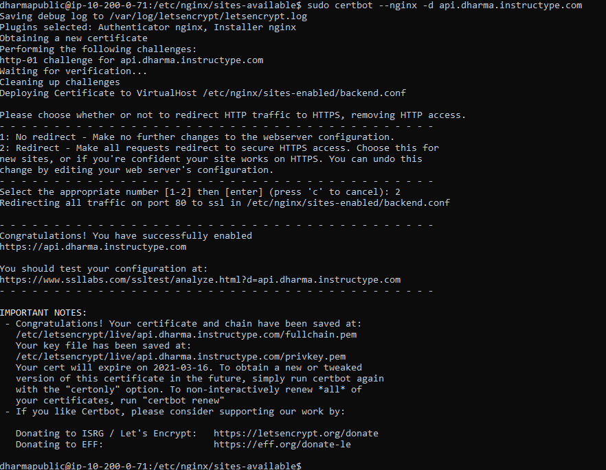

# SSL CONFIGURATION

- Membuat SSL dengan certbot pada server backend dengan domain `api.dharma.instructype.com` hal yang dilakukan sama seperti pada membuat ssl di frontend.

- Testing dengan akses url `api.dharma.instructype.com` ke browser untuk mengecek certificate.

- Ubah url API config/api.js pada masing-masing server frontend untuk integrasi ke server backend atau API.

- Test login dengan user yang sudah dibuat pada proses reverse proxy.

