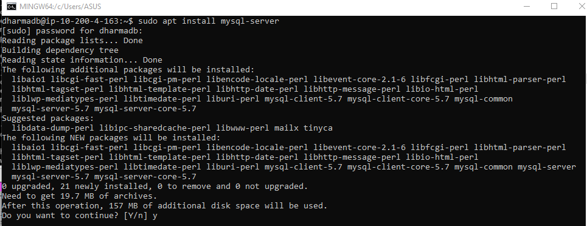
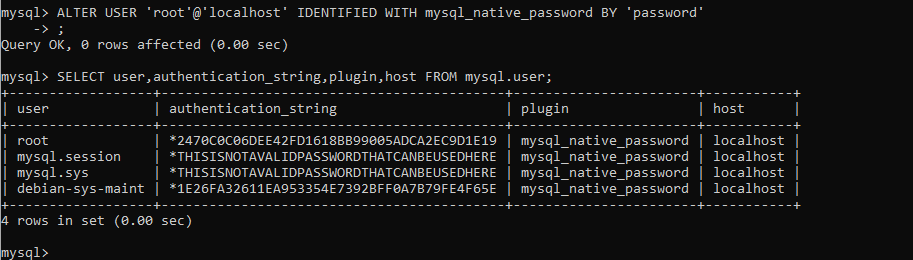
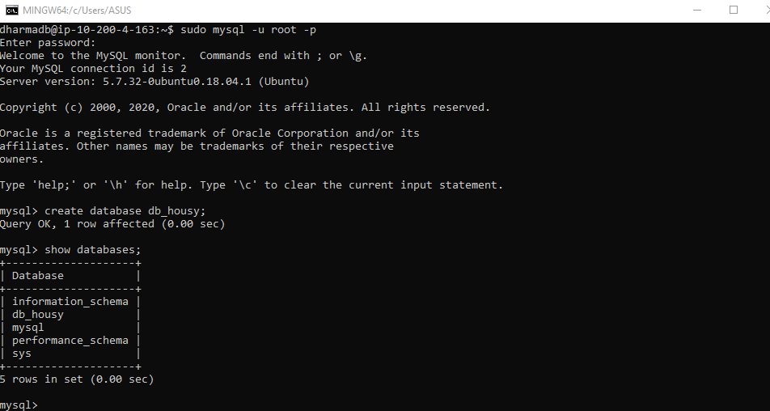
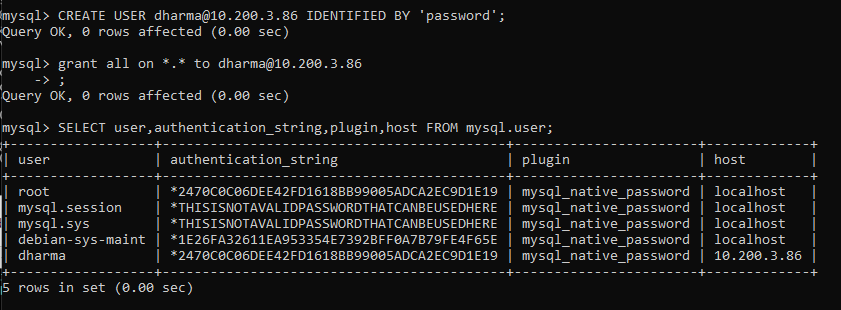
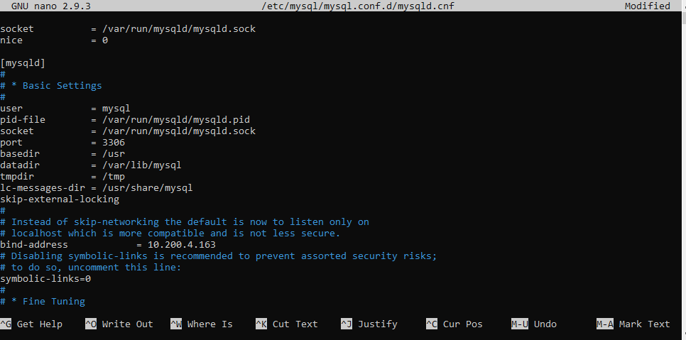

# Setup Database

- Install MYSQL server pada Instance yang berfungsi sebagai database server dengan perintah `sudo apt install mysql-server`



- Setelah melakukan proses installasi, user default yaitu root dengan tanpa password, untuk mememberikan password user root perlu masuk ke dalam mysql dan jalankan perintah.

``` ALTER USER 'root'@'localhost' IDENTIFIED WITH mysql_native_password BY 'passwordbaru' ```

Dan melakukan login ulang lalu membuat database db_housy untuk menampung data yang akan digunakan pada aplikasi





- Membuat User untuk mengakses server database dari server backend dengan memberikan full akses 



- Selanjutnya mengubah bind-address pada file mysqld.conf pada directory /etc/mysql/mysql.conf.d dengan ip private server database.



