# CREATE DOCKER IMAGE FRONTEND

- Membuat Dockerfile dengan isi sebagai berikut

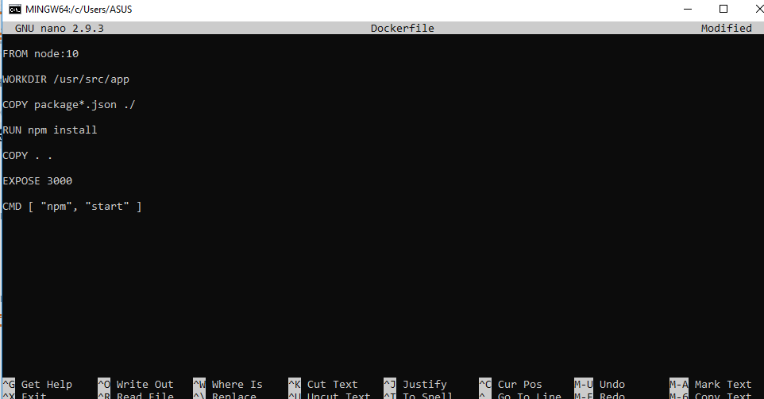

- Build dengan perintah sebagai berikut

```
docker build -t namaimage:tag .
```

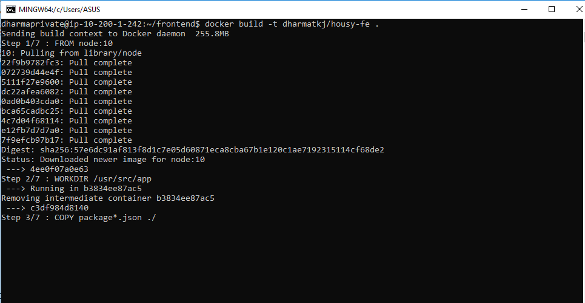

- Cek docker images yang sudah dibuild

```
docker images
```

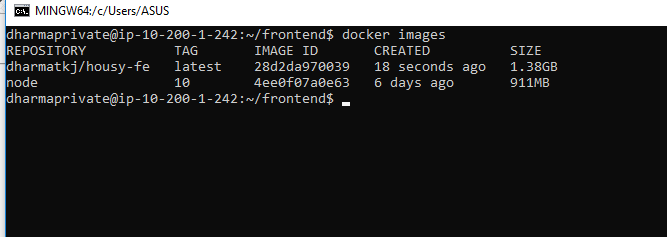

- Menjalankan aplikasi frontend dengan docker run, yang perlu diperhatikan pada aplikasi frontend perlu interactive shell sehingga perlu parameter -it

```
docker run --name housy_fe -it -d -p 3000:3000 dharmatkj/housy-fe:latest
```

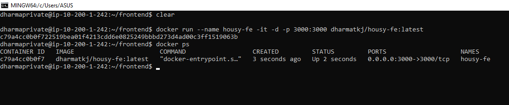


NB: pastikan port tidak bentrok dengan aplikasi lain.

- Cek jika container sudah berjalan dengan `docker ps` atau bisa cek dengan `docker log nama-container`

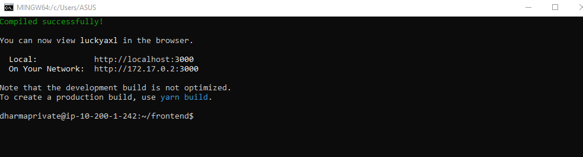

- Untuk push image, buat image dengan format akundocker/namaimage:tag dan pastikan sudah login terlebih dahulu. lalu jalankan perintah 

```
docker push namaimage:tag
```

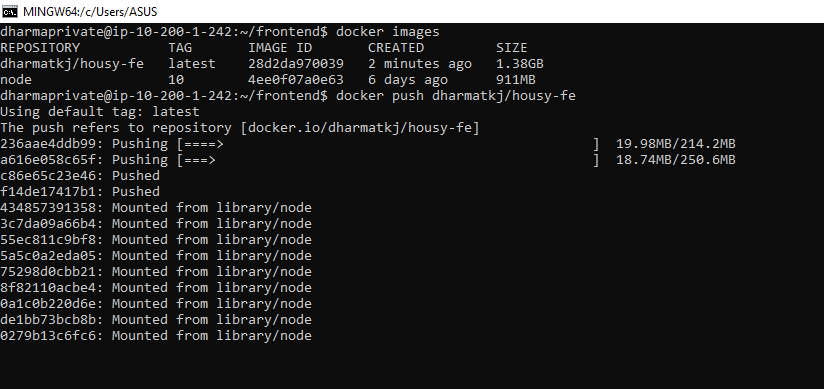

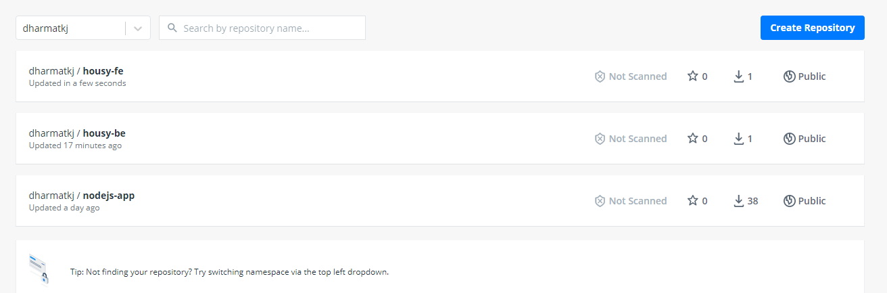

# CREATE DOCKER IMAGE BACKEND

- Terkait langkah-langkah pada dasarnya sama seperti membuat images pada frontend, namun ada beberapa parameter yang berbeda seperti port ataupun dependency package berikut dockerfile dari backend.

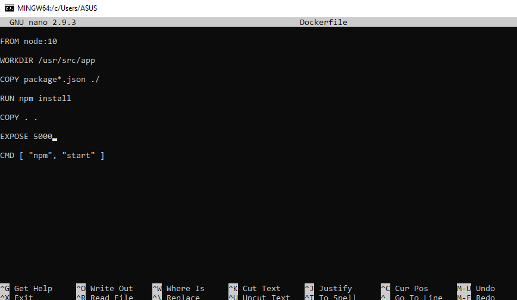

- Proses build images untuk aplikasi backend

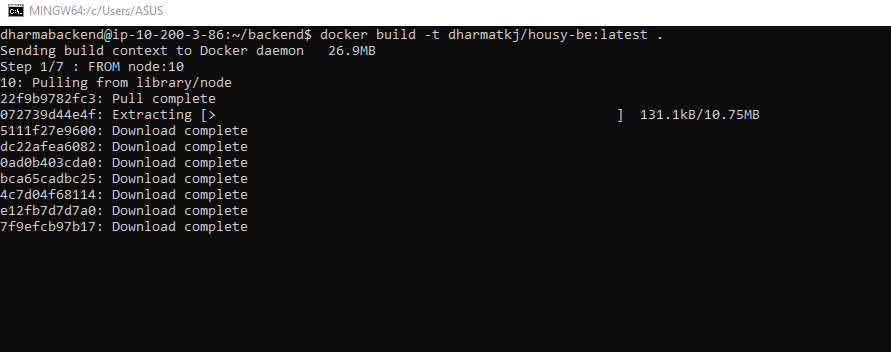

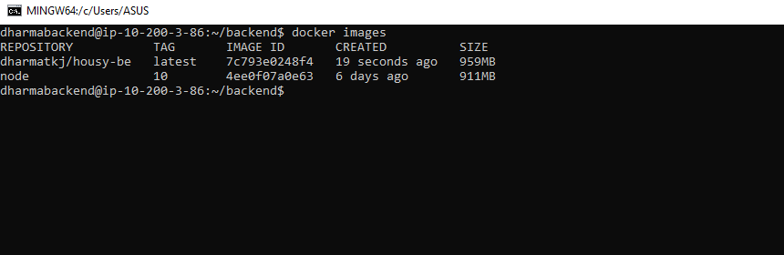

- Proses pembuatan container dan running container.

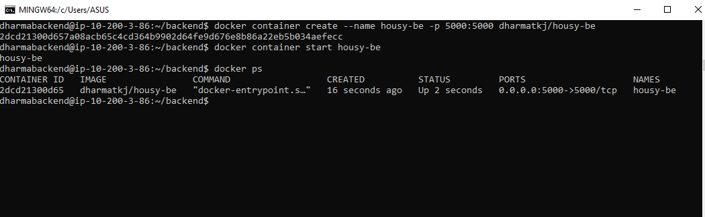

- Proses docker push image ke docker hub

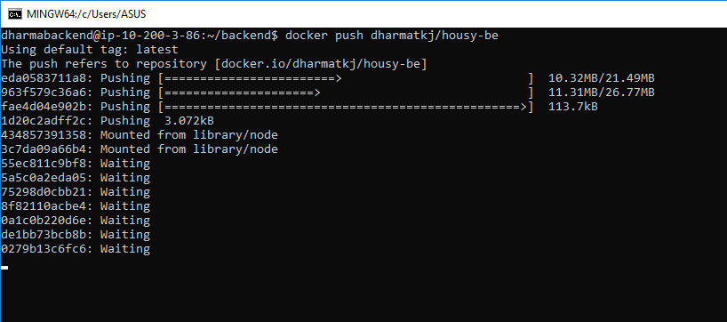

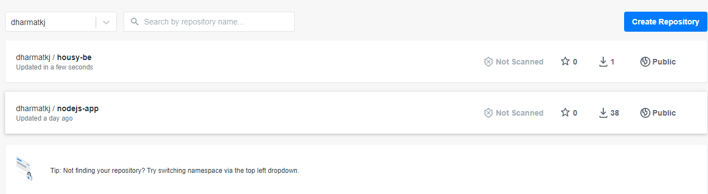

# MULTISTAGE IMAGE PADA DOCKERFILE

```
Dengan multi-stage build kita bisa menggunakan statemen FROM lebih dari 1, dan setiap FROM bisa menggunakan base image yang berbeda, dan setiap statemen FROM dipanggil menandakan pembuatan image pada stage baru, anda juga bisa dengan mudah menyalin artifacts dari satu stage ke stage lain, sehingga size image bisa menjadi lebih kecil daripada yang tanpa menggunakan multistage.

```
- Berikut Docker file multistage dari frontend

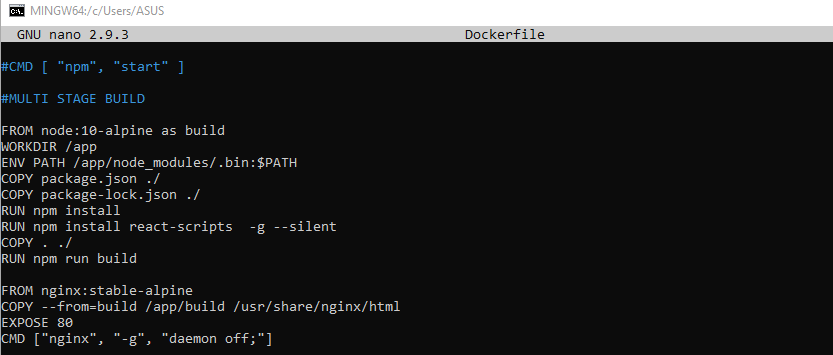

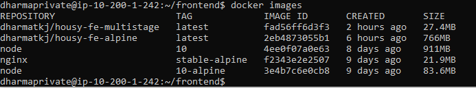

- Berikut Docker file multistage dari backend

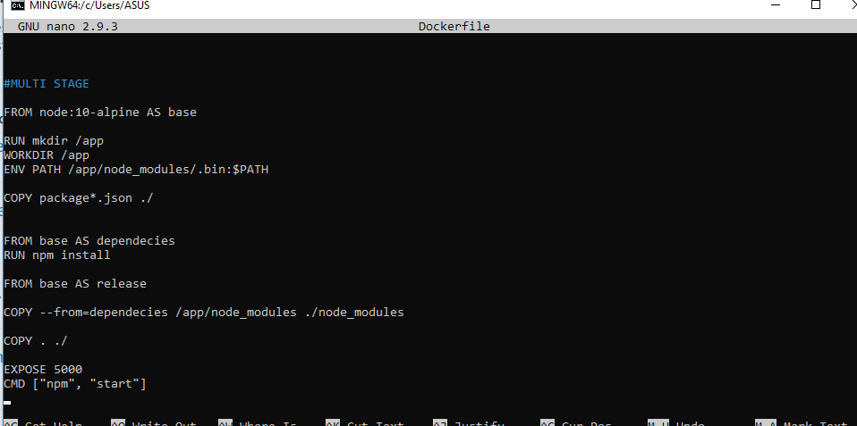

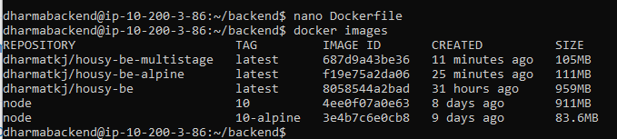