# CREATE JENKINS JOB

- Pertama yang saya lakukan adalah membuat token github agar bisa diakses oleh jenkins, token yang digunakan berfungsi untuk mendapatkan akses workflow repo dan read/write.

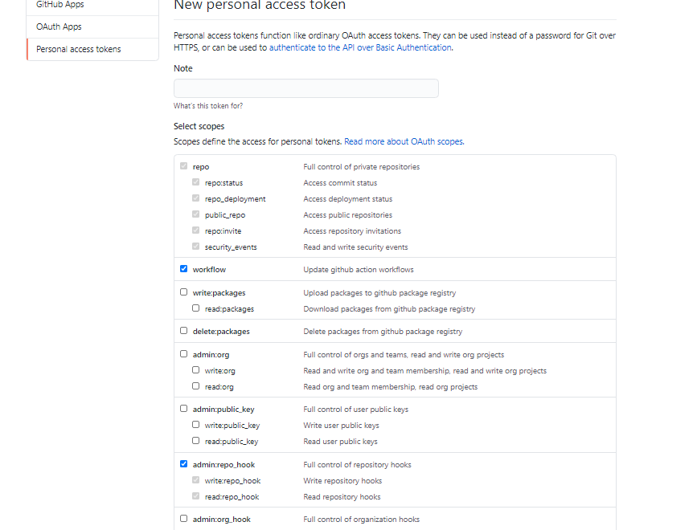

- Selanjutnya menambahkan token yang sudah digenerate pada github dan diconfigure ke jenkins pada bagian github server. Untuk credential tambahkan terlebih dahulu dengan type `Secret text`.

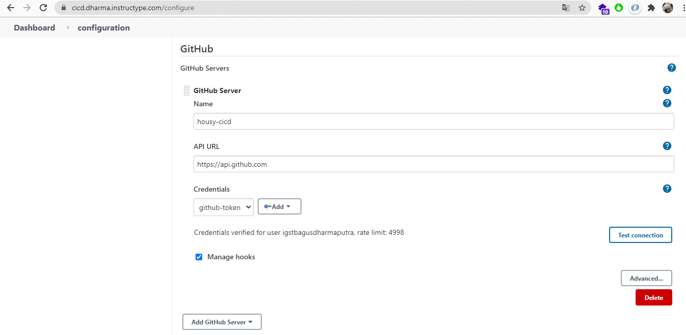

- Membuat job baru dengan `Free stype project` lalu menambahkan repository url dan credential dari private key frontend sertah brach `main` pada github repository.

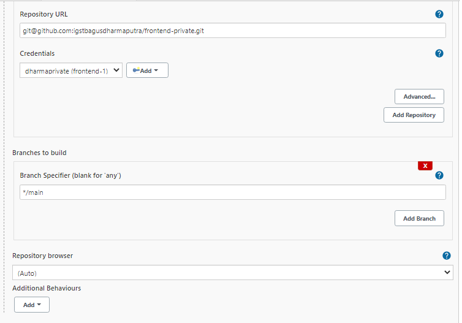

- Centang `Github hook trigger for GITScm polling` untuk integrasi source code ke github.

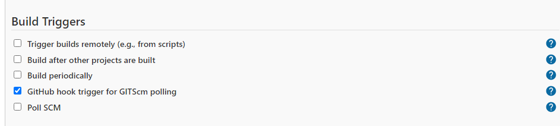

- Menambahkan ssh server remote yang ingin dihubungkan dengan publish over ssh. Pada kasus ini, saya tidak menggunakan ssh key private dari frontend.

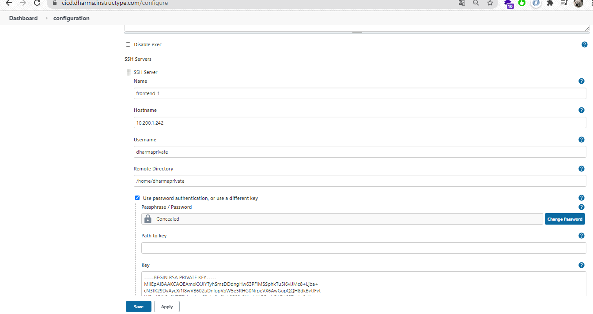

- `Pada proses build di job jenkins menggunakan plugin publish over ssh, yang sebelumnya sudah di konfigurasi dan sudah berhasil konek ke remote server. Untuk remote directory udah masuk /home/user dan exec command berisi perintah yang akan dijalankan pada server remote. Pada tahap build pada dasarnya adalah proses change directory, melakukan pull source code terbaru, mematikan container, menghapus images sebelumnya, melakukan build image terbaru dan menjalankan container.` Berikut langkah atau konfigurasi build pada image multistage dan tanpa multistage pada aplikasi frontend 

## Build Frontend Dengan Image Multistage dan Tanpa Multistage

- Untuk exec command pada frontend pertama menggunakan image dengan tag multistage:latest serta memberikan jeda waktu beberapa menit dan melakukan penghapusan image dangling.

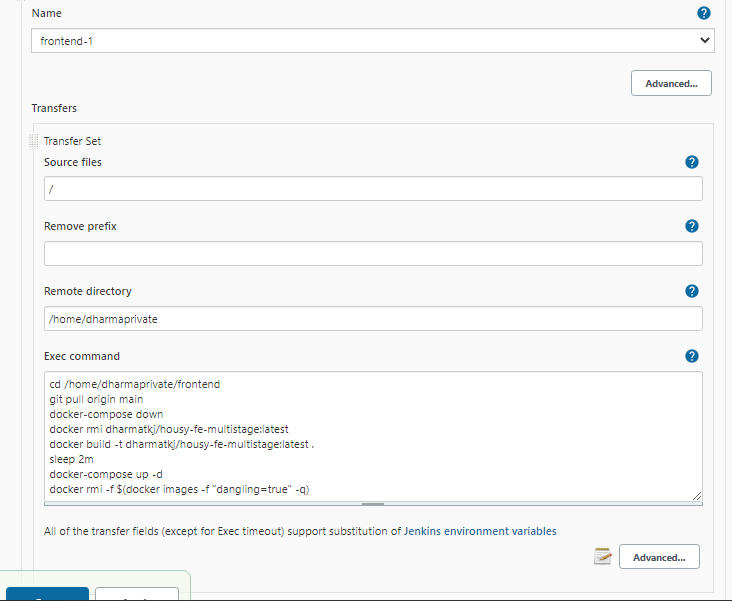

- Selanjutnya untuk frontend kedua hanya melakukan pull image terbaru yang didapatkan dari proses build di dockerhub.

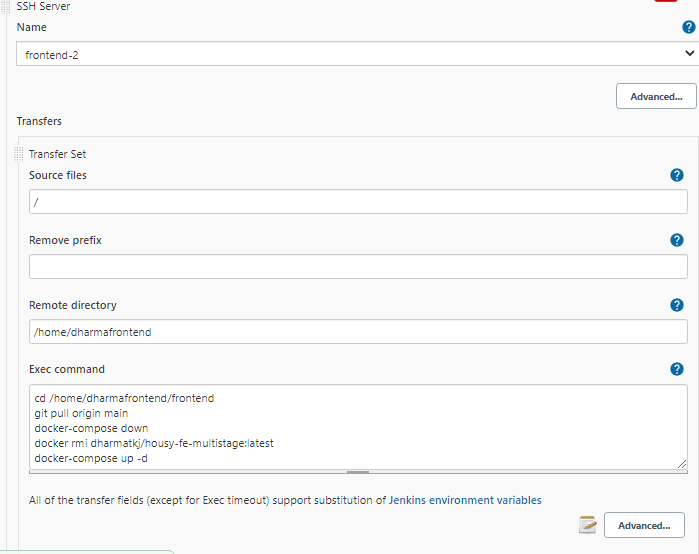

- Untuk yang tanpa multistage pada frontend pertama dan kedua tidak memerlukan durasi waktu serta dengan tag image yang berbeda.

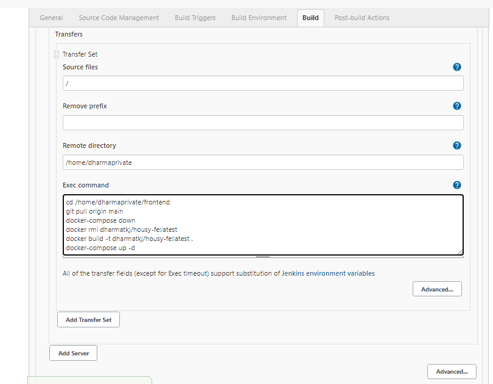

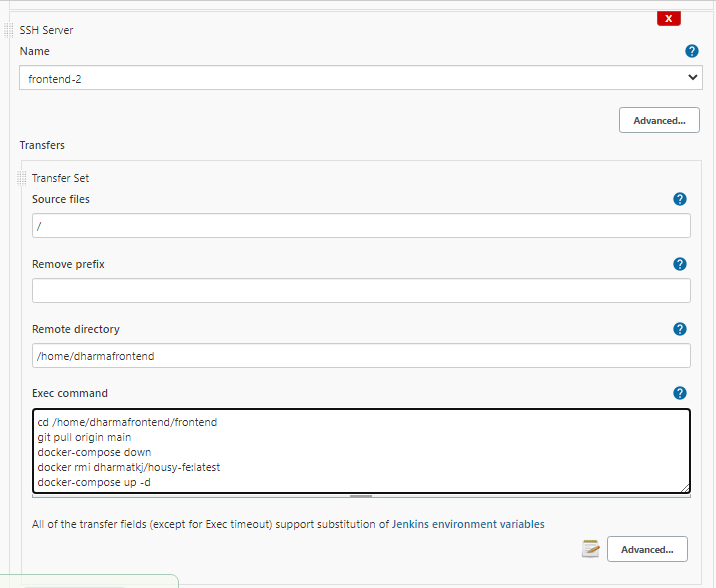

- Untuk setiap job pastikan sudah set 0 ms pada build, untuk mengantisipasi terjadinya proses build yang tidak bisa kita tentukan dikarenakan tergantung koneksi internet.

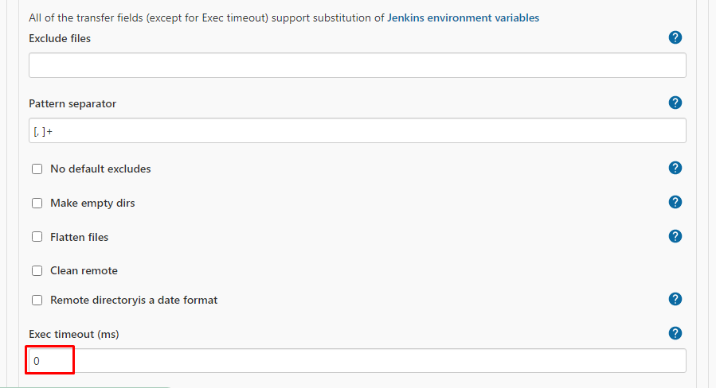

- Untuk push image ke docker saya menggunakan fitur yang sudah disediakan oleh docker, yaitu docker build yang terintegrasi dengan akun github, jadi ketikan melakukan push terhadap repositoy github maka docker akan otomatis melakukan proses build baru untuk melakukan perubahan yang terdapat pada repository github.

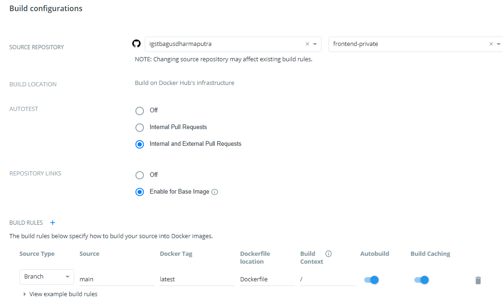

- Contoh ketika proses build selesai tedapat informasi yang bisa dilihat seperti recent builds.

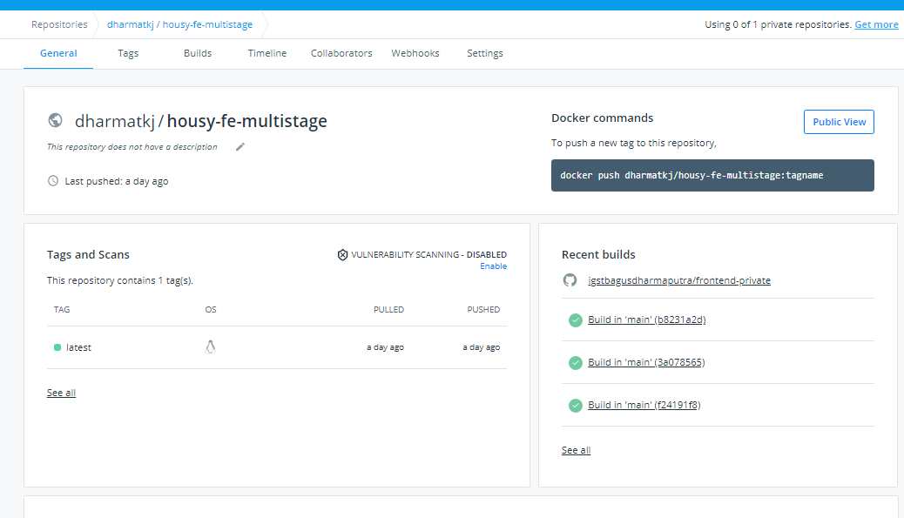

- Berikut hasil ketika melakukan push ke repository github dan jenkins melakukan proses CI/CD.

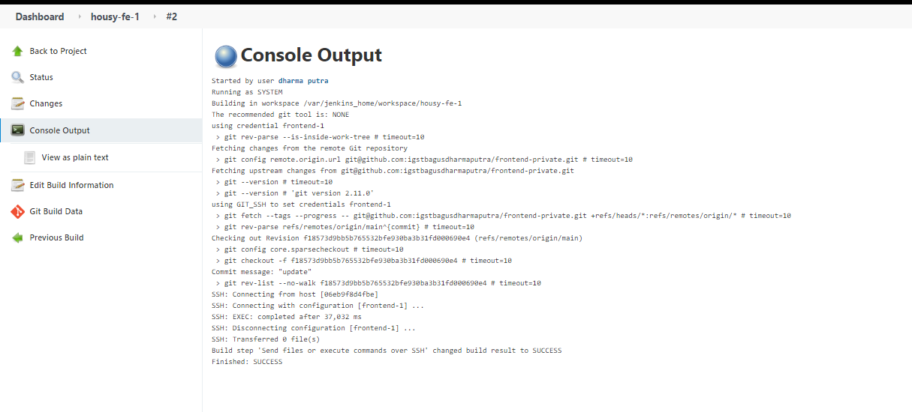

- Berikut log github dari jenkins

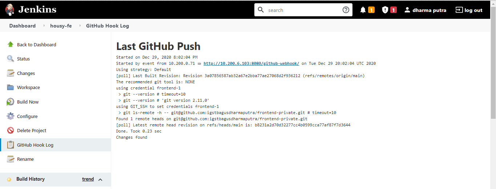

# Setting Notification pada Jenkins dengan Slack Notification

- Install plugin slack notification pada jenkins.

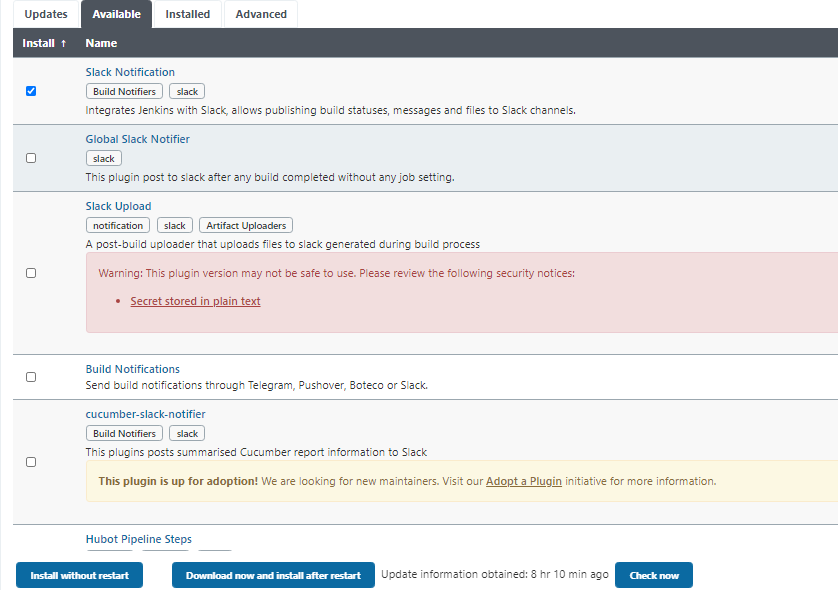

- Hubungkan atau integrasikan aplikasi slack ke jenkins.

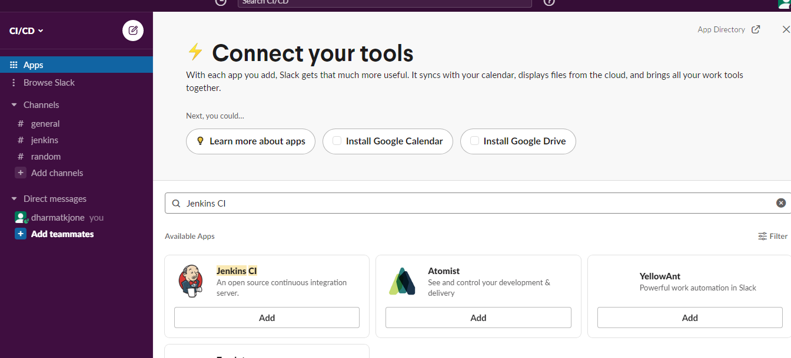

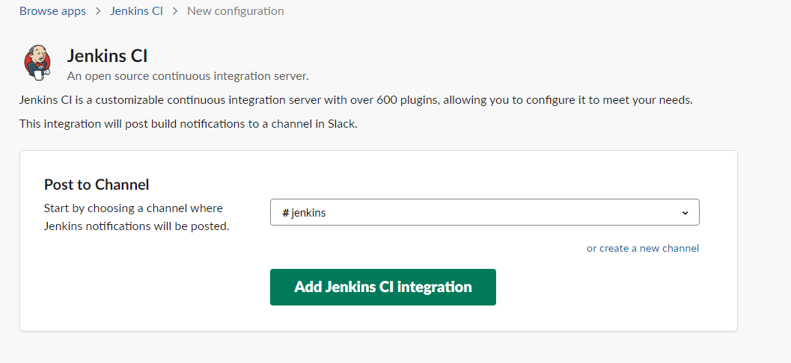

- Pada saat melakukan intergasi slack kita mendapatkan token, sehingga perlu menambahkan ke credential jenkins untuk token tersebut.

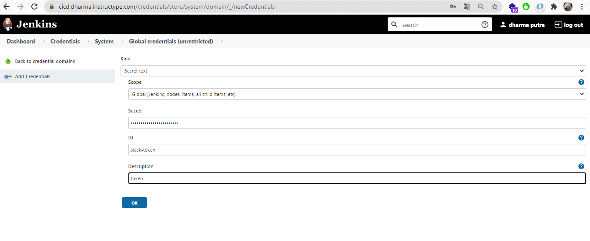

- Pada configure system cari bagian slack dan konfigurasi bagian workspace isi dengan nama yang sudah disediakan dari slack aplikasi, default channel isikan dengan nama channel dan untuk credential menggunakan slack-token yang sudah dibuat.

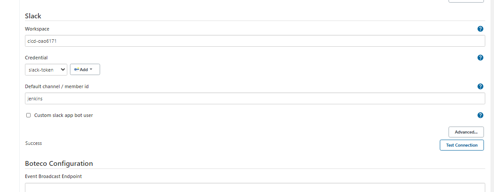

- Pada setiap job build kita perlu menambahkan konfigurasi Post Build Action yang berfungsi untuk memberikan informasi ketika telah melakukan proses build.

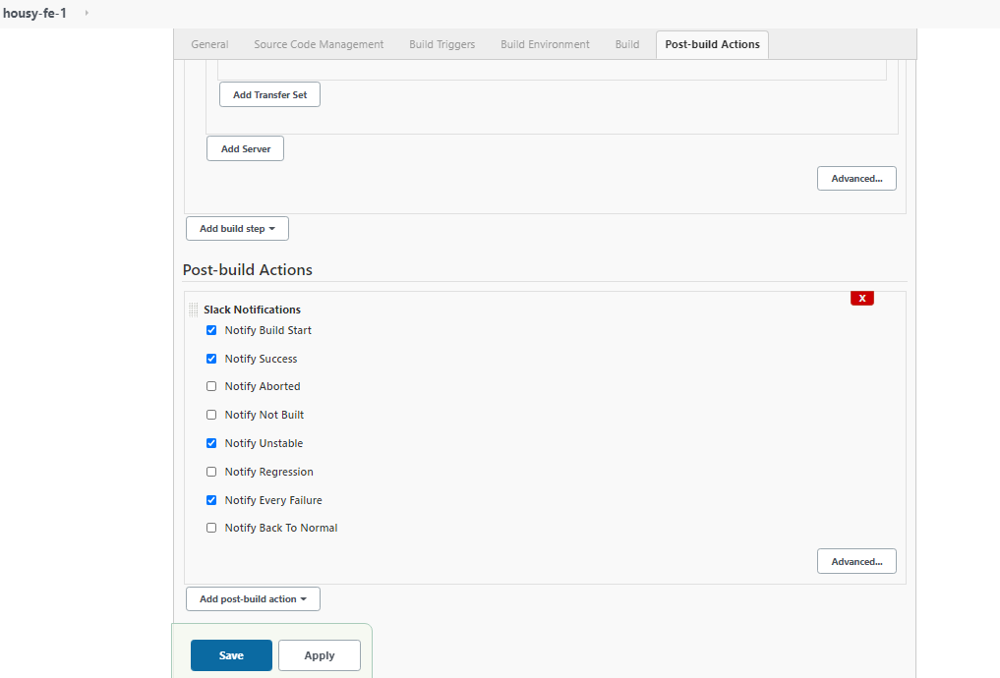

- Berikut hasil konfigurasi atau notification dari slack.

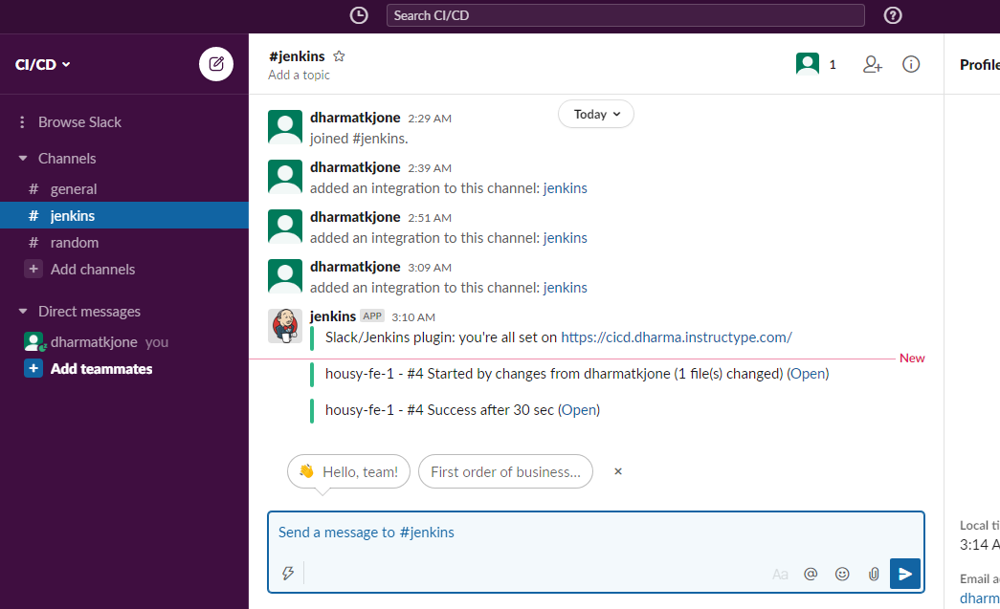