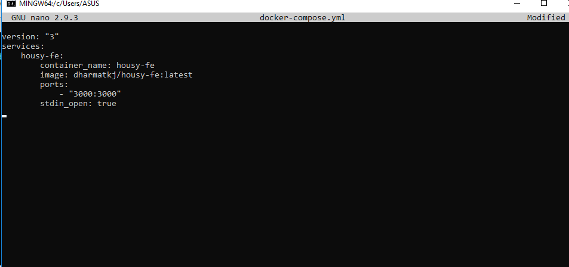
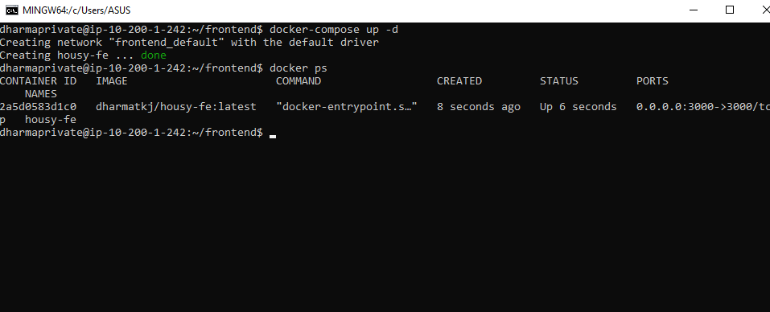
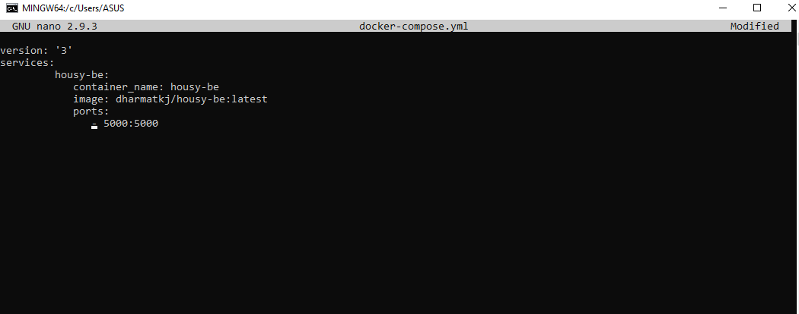
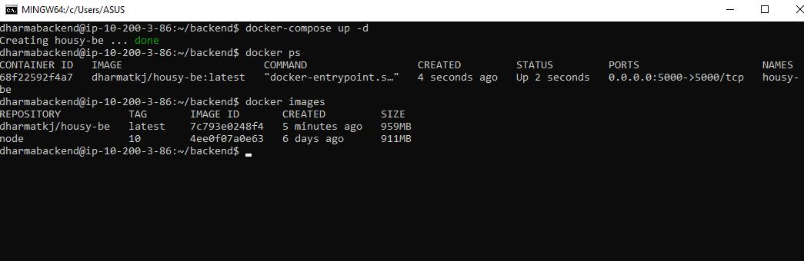
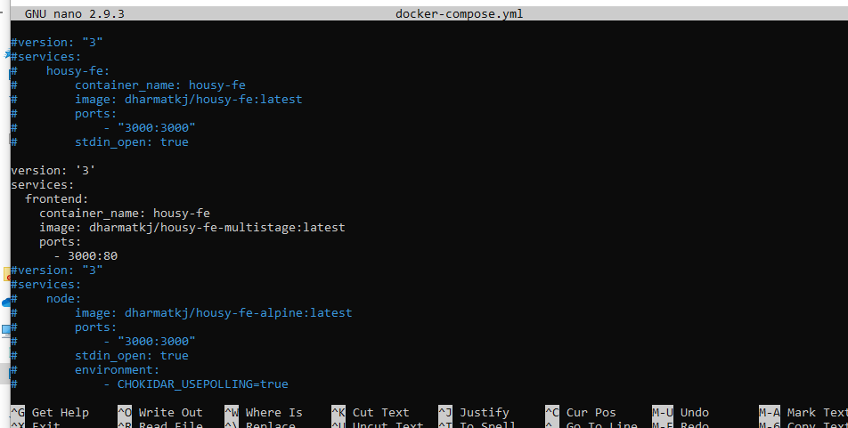
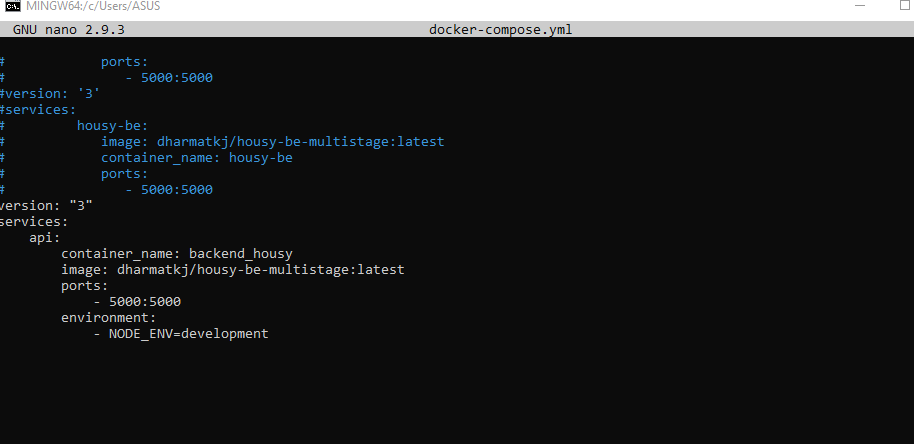

## INSTALL APPLICATION FRONTEND

- Hal yang pertama yaitu membuat file docker-compose.yml pada project dan menbahkan script seperti gambar berikut. Pada frontend perlu menambahkan stdin_open.

- Selanjutnya menjalankan aplikasi tersebut dengan `docker-compose up -d`.

## INSTALL APPLICATION BACKEND

- Lakukan hal yang sama pada frontend, hanya saja isi file dari docker-compose.yml berbeda.

## INSTALL APPLICATON IMAGE MULTISTAGE

- Pada multistage pada frontend dan backend kurang lebih hampir sama dengan tanpa multistage hanya saja yang perlu diperhatikan pada frontend adalah port yang sudah di expose pada dockerfile.

