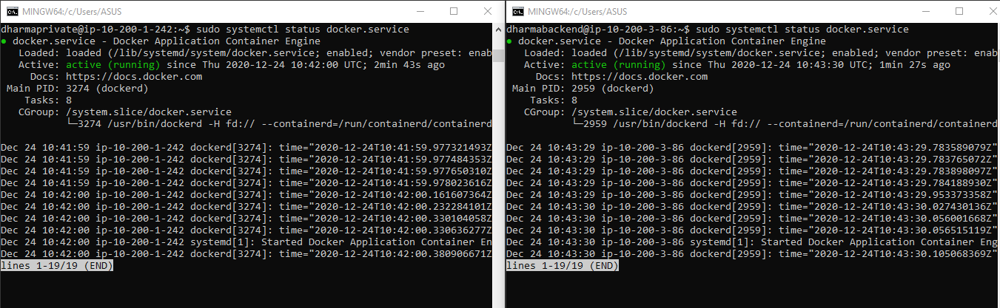
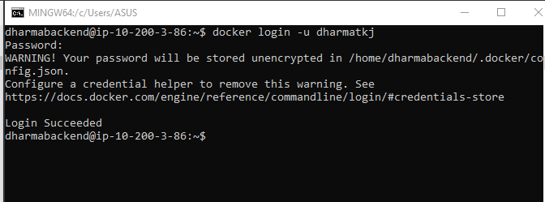
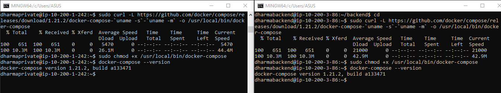

# INSTALL DOCKER

- Menambahkan beberapa paket setelah melakukan update dan upgrade
```
sudo apt-get install curl apt-transport-https ca-certificates software-properties-common
```

Berikut keterangnya:

	- apt-transport-https = tansfer file dan data melalui https.
	- ca-certificates = untuk cek sertifikat keamanan
	- curl = transfer data
	- software-properties-common = script untuk mengelola software.


- Menambahkan repository docker dan update paket
```
curl -fsSL https://download.docker.com/linux/ubuntu/gpg | sudo apt-key add -
sudo add-apt-repository "deb [arch=amd64] https://download.docker.com/linux/ubuntu $(lsb_release -cs) stable"
sudo apt update
apt-cache policy docker-ce
```


- Instal docker
``` 
sudo apt install docker-ce
```


- Cek status docker
```
sudo systemctl status docker
```



- Login ke docker
```
docker login
``` 


# INSTALL DOCKER COMPSE

- Install docker-compose untuk melakukan running container dengan mudah atau dapat menjalankan container lebih dari satu.
```
sudo curl -L "https://github.com/docker/compose/releases/download/1.27.4/docker-compose-$(uname -s)-$(uname -m)" -o /usr/local/bin/docker-compose

sudo chmod +x /usr/local/bin/docker-compose

docker-compose --version

```

