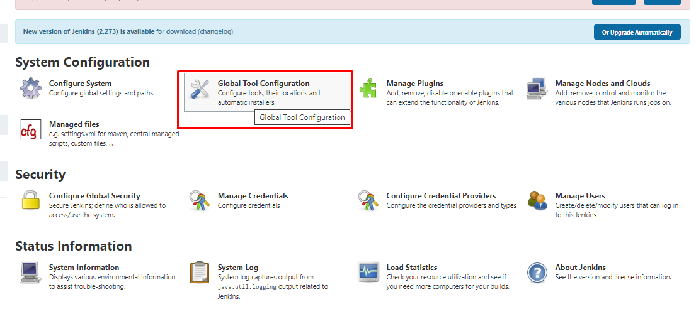

# Create Job dengan Jenkins Pipeline Script

## Install Jenkins

- Install menggunakan Dockerfile dikarenakan jenkins yang didalam container tersebut memerlukan docker untuk proses build dan lakukan build image pada dockerfile tersebut.


- Jalankan container dengan image yang sudah dibuild, untuk jenkins pada docker hal yang diperlukan yaitu volume docker.sock, volume untuk jenkins_home, serta url jenkins prefix. Untuk jenkins prefix bertujuan agar tidak bentrok dengan jenkins yang sudah di install sebelumnya, serta port yang digunakan harus berbeda.


- Melakukan reverse proxy pada aplikasi jenkins.


- Hasil install jenkins


## Install plugin yang diperlukan untuk Jenkins

- Plugin yang diperlukan yaitu Docker pipeline, Nodejs, Github Integration, dan SSH Agent.


- Konfigurasi Untuk tool yang digunakan pada menu Global Tool Configuration



- Setting tool git 


- Setting tool Node Js dengan versi 10


- Setting tool Docker


## Configure Webhook Jenkins to Github

- Pertama membuat API token pada jenkins untuk integrasi dengan github.


- Masuk ke repository project dan konfigurasi webhook serta memberikan secret dengan token jenkins.


- Hasil konfigurasi


## Create Job

- Membuat credential ssh dengan private key pada jenkins.


- Membuat credential username dan password untuk docker login.


- Membuat job baru dengan mode Pipeline


- Lalu check list Github hook trigger for GITScm Polling


- Sebelum melakukan build pastikan pada project sudah terdapat Jenkinsfile. Lalu isikan dengan script.
```
pipeline {
  environment {
     dockerRegistry = "dharmatkj/housy-be-multistage-2"
     dockerRegistryCredential = 'docker'
     dockerImage = ''
  }
  agent any
  tools {nodejs "node" }
  stages {
    stage('Cloning Git') {
      steps {
	      git branch: 'main', credentialsId: 'backend', url: 'git@github.com:igstbagusdharmaputra/backend-private-2.git'
      }
    }
    stage('Build') {
       steps {
         sh 'npm install'
       }
    }
    stage('Test') {
      steps {
        echo 'test'
      }
    }
    stage('Building image') {
       steps{
         script {
           dockerImage = docker.build dockerRegistry + ":latest"
         }
       }
     }
    stage('Upload Image') {
       steps{
         script {
           docker.withRegistry( '', dockerRegistryCredential ) {
             dockerImage.push()
           }
         }
       }
     }
     stage('Remove Unused docker image') {
       steps{
         sh "docker rmi $dockerRegistry:latest"
         sh 'docker rmi -f $(docker images -f "dangling=true" -q)'
       }
     }
     stage('Deploy App') {
        steps{
          sshagent(credentials: ['backend']) {
             sh """ ssh -t -t dharmabackend@10.200.3.86 -o StrictHostKeyChecking=no << EOF 
                cd /home/dharmabackend/backend-2/
                docker-compose down
                git pull origin main
                docker rmi dharmatkj/housy-be-multistage-2:latest
                docker-compose up -d
                exit
                EOF"""
            
          }
        }
     }
  }
}
```

- Selanjutnya proses integrasi build dengan github repository.


- Pastikan bahwa jenkins sudah bisa melakukan remote ssh ke server aplikasi.


- Berikut hasil Build job 


