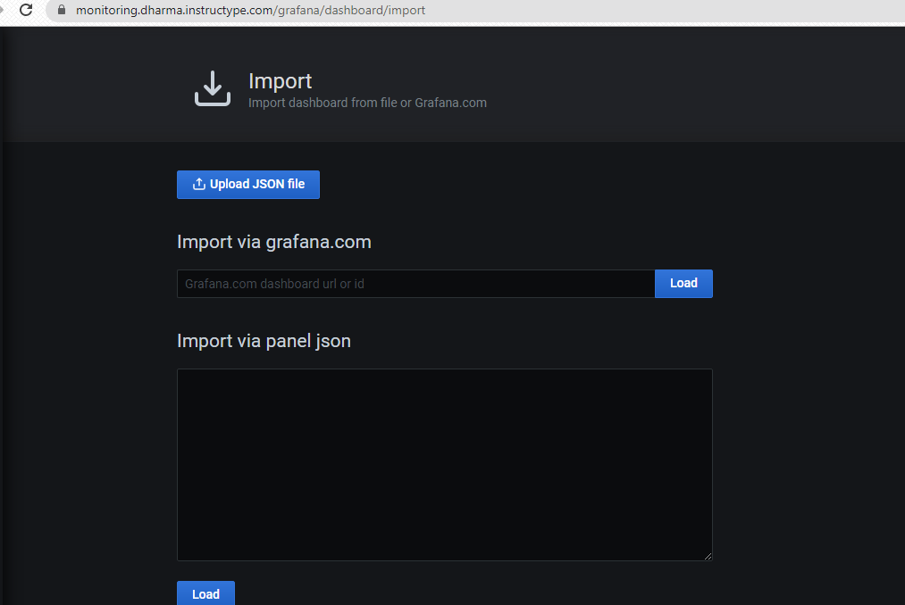

# CONNECT MULTIPLE SERVER TO PROMETHEUS

- Membuat file konfigurasi prometheus untuk dijalan pada aplikasi docker dan mount terhadap directory /etc/prometheus.

- Untuk mendapatkan data informasi dari server lalu dikirimkan ke prometheus, maka perlu menginstall node exporter pada setiap server. Install node exporter dilakukan dengan anisble dan docker untuk aplikasinya.

- Dari prometheus terdapat kekurangan seperti tampilan untuk memberikan informasi terhadap user, sehingga pada kasus ini menggunakan grafana yang dimana informasi tersebut didapat dari metric prometheus lalu di konversi ke grafana. Langkah awal memerlukan file konfigurasi grafana.ini setting route path serta domain.

- Melakukan proses import dashboard dengan file .json melalui sumber `https://grafana.com/grafana/dashboards/11074` atau `https://grafana.com/grafana/dashboards/405`

