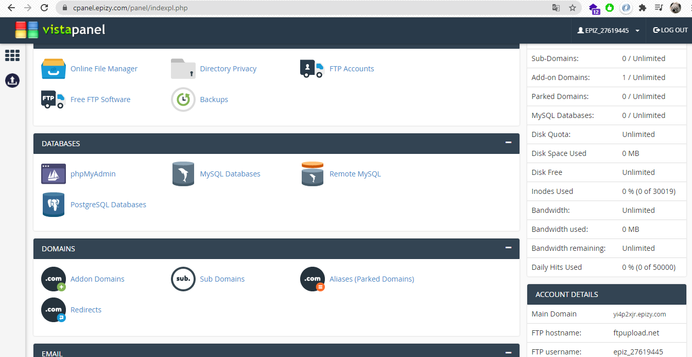
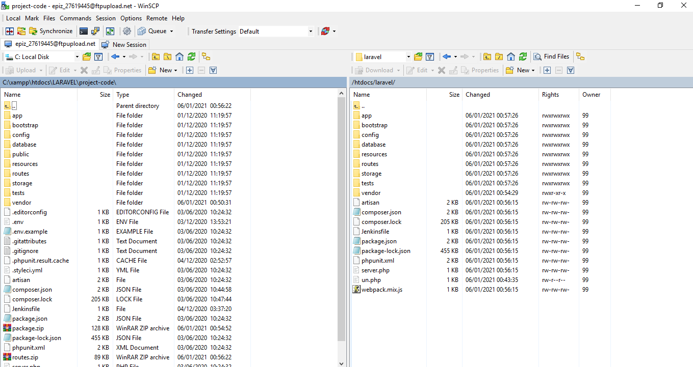
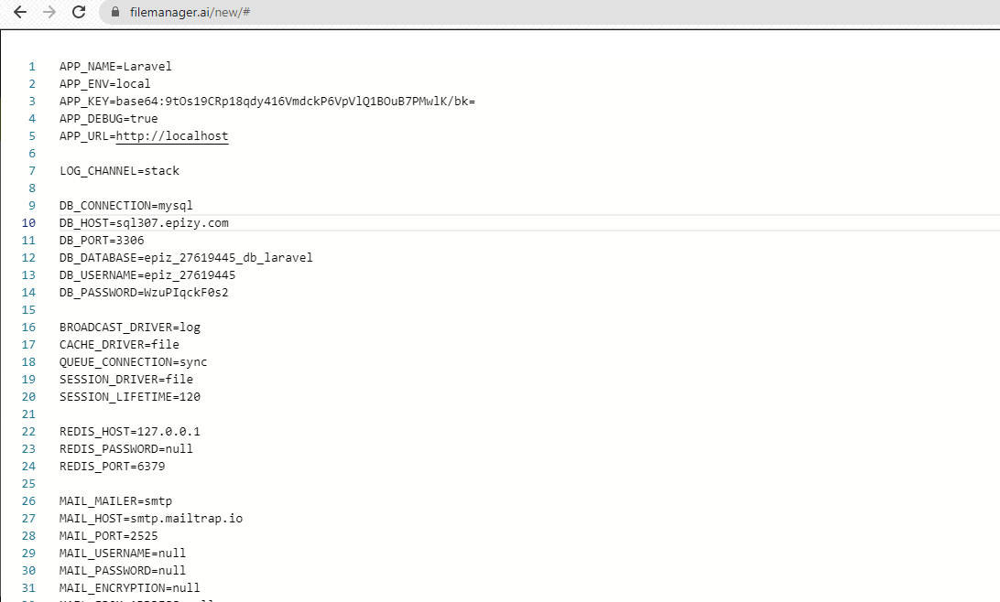
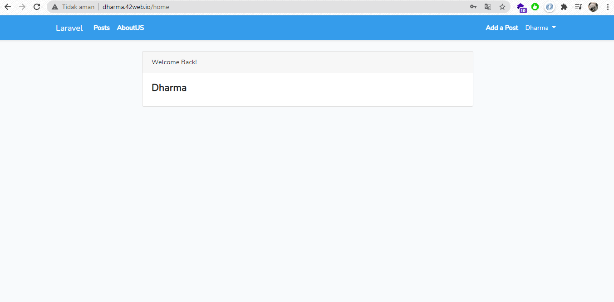
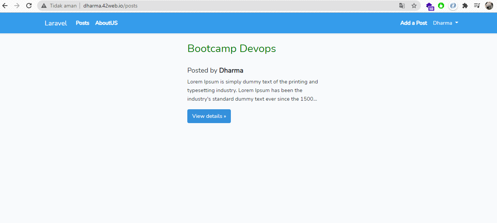
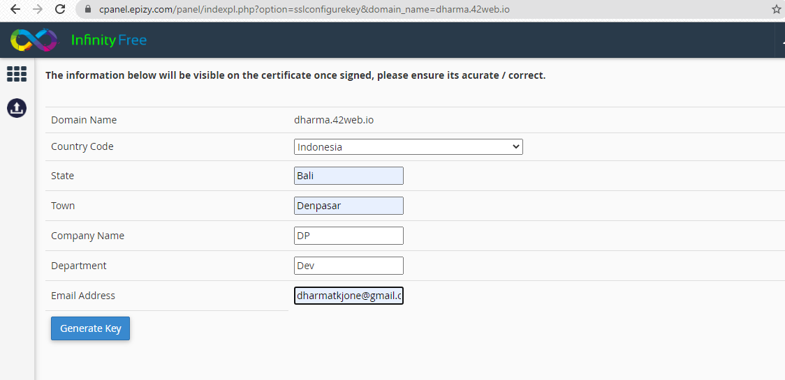
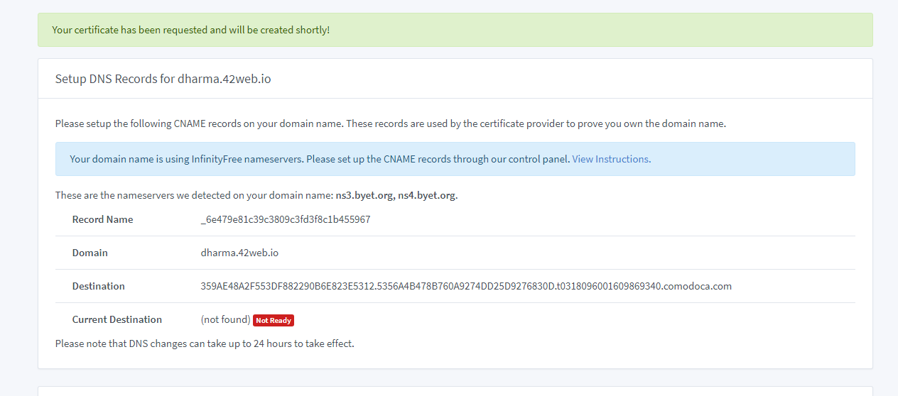
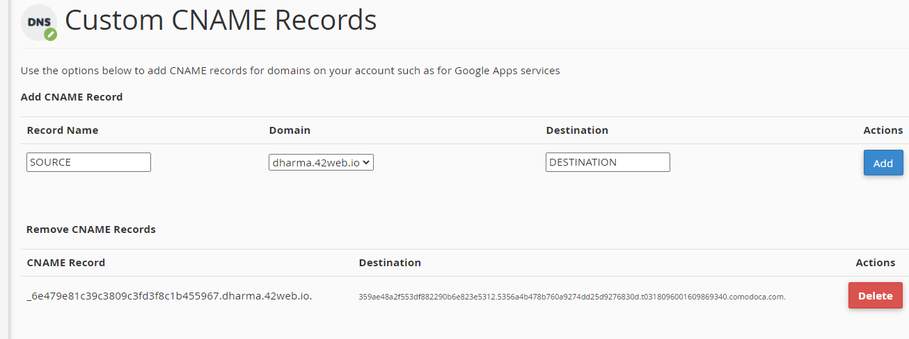
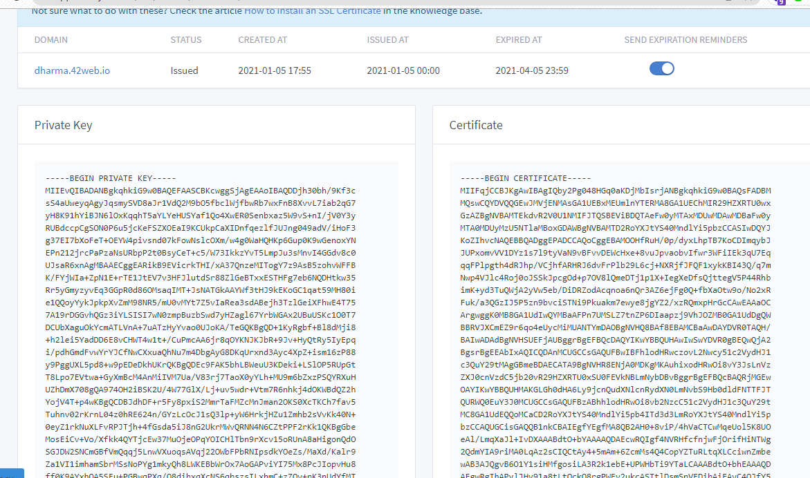
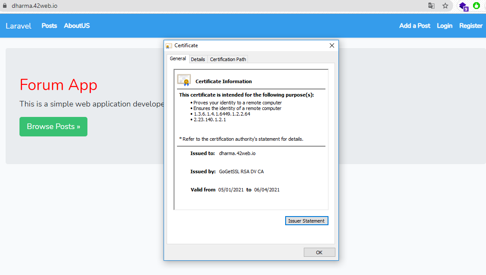

# DEPLOY PHP APPLICATION IN CPANEL

## Berikut beberapa platform yang saya gunakan untuk deploy php application:

#### Aplikasi yang akan dideploy adalah [Blog Web dengan Laravel](https://laravel.com/)
#### cPanel  yang digunakan adalah [Infinity free](https://infinityfree.net/)
#### SSL yang dipakai adalah [GoGetSSL](https://www.gogetssl.com/)
#### Wiscp yang digunakan adalah [Winscp](https://winscp.net/)
#### Domain cPanel saya adalah [dharma.42web.io](https://dharma.42web.io/)

Langkah - langkah yang dilakukan untuk deploy aplikasi pada cPanel adalah sebagai berikut:

- Siapkan project laravel yang akan di deploy 
- Daftar ke cPanel dan pilih domain dan subdomain yang akan dipakai untuk mengakses aplikasi, pada kolom yang ada dikanan terdapat info yang bisa digunakan untuk mengakses ftp dan database

- Transfer file project dengan Winscp dengan ftp server yang ada di hosting.

- Dalam laravel perlu mengubah isi file .env dengan konfigurasi server database yang ada pada hosting.

- Pada cpanel Infinitfree sudah tersedia ssl gratis yang berlaku selama 60 hari, ssl tesebut didapatkan dengan cara mendaftarkan data yang diperlukan.

- Setelah proses selesai maka mendapatkan Certificate yang akan dikonfigurasi pada menu SSL dashboard cPanel.

