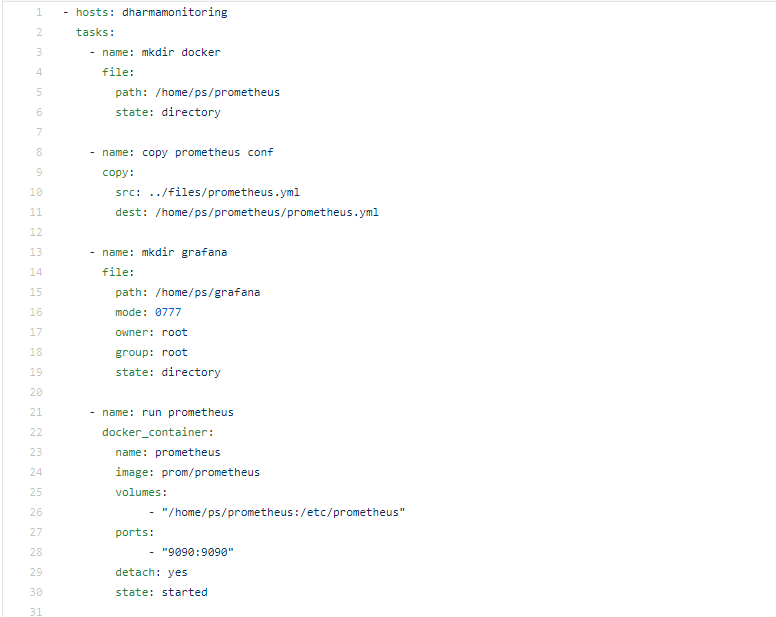
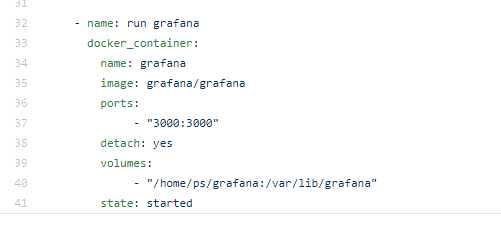
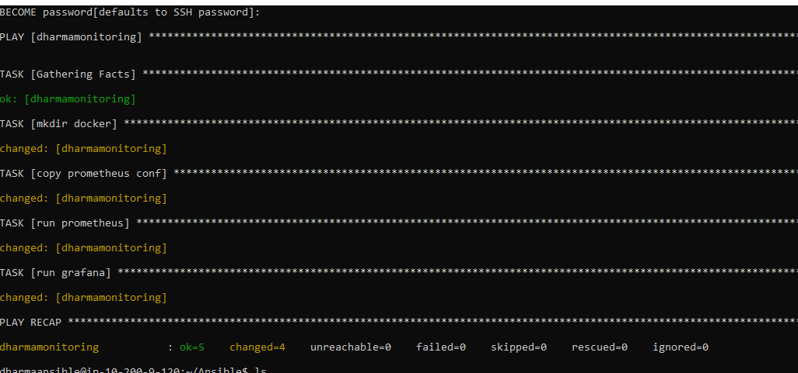
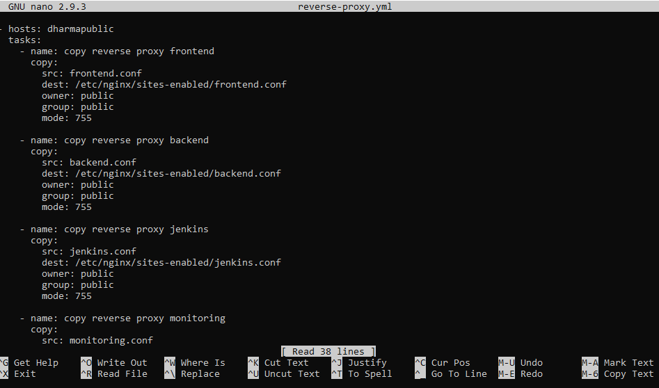
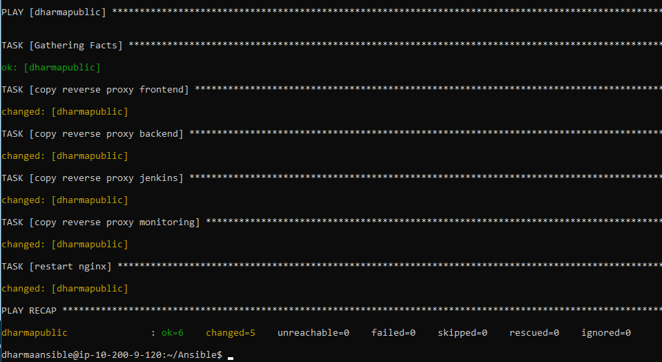
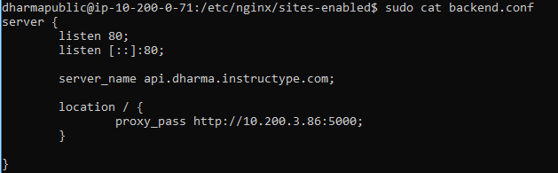
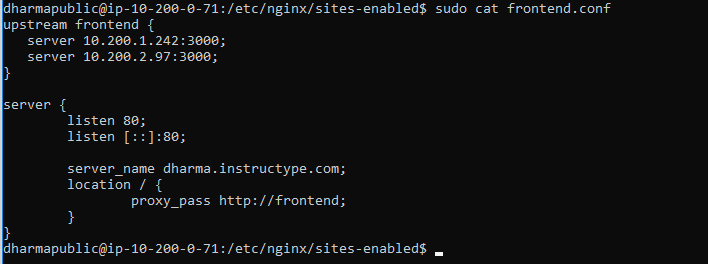
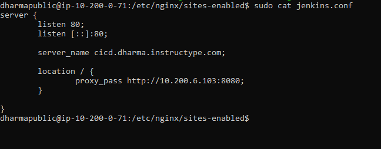
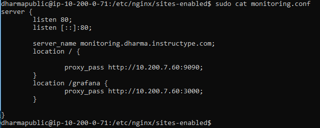

# SETUP MONITORING SERVER

- Melakukan proses install prometheus dan grafana pada server monitoring dengan bantuan ansible untuk proses otomasi dan docker menjalankan aplikasi.

- Melakukan proses otomasi terhadap reverse proxy nginx dengan melakukan copy file konfigurasi .conf ke server public

- Selanjutnya melakukan konfigurasi ssl dengan aplikasi certbot dan proses otomasi dari ansible.

- Untuk prometheus terdapat kelemahan dalam security pada saat mengakses server tersebut, sehingga perlu authentication dari webserver nginx.

