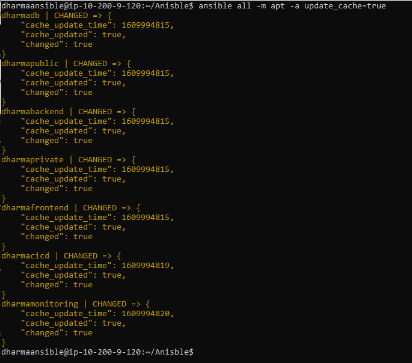
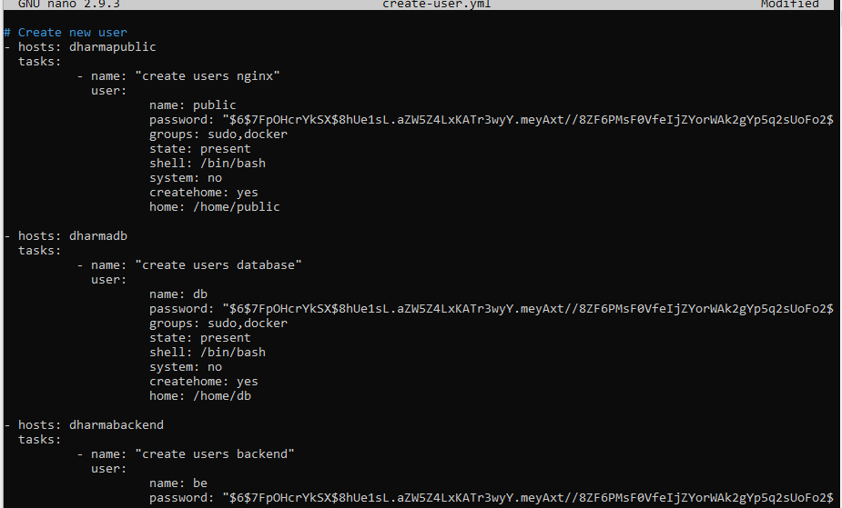

# SETUP SERVER WITH ANSIBLE

- Install ansible secara manual tanpa menggunakan docker
```
apt install python
sudo apt-add-repository ppa:ansible/ansible
apt update
apt install ansible
```


- Untuk langkah awal buat suatu folder untuk project Ansible dan tambahkan file `Inventory` untuk melakukan remote dengan user root dan file `ansible.cfg` untuk konfigurasi ansible


- Melakukan edit file ssh yaitu `authorized_keys` pada server.


- Pengujian melakukan remote dengan user root terhadap server.


- Ketika ansible sudah terhubung dengan server lainnya, maka lakukan pengujian ping pada ansible.


- Melakukan upgrage dan update repository tehadap server yang terhubung dengan ansible.




- Selanjutnya membuat user remote untuk sever yang tehubung dengan ansible, dengan bantuan automation file .yml ansible serta beberapa hal yang perlu diperhatikan adalah pada saat membuat password user adalah enkripsi pada account user tersebut, sehingga perlu menggunakan batuan tool `mkpasswd` dengan method sha-512





- Pengujian remote dengan user


NB: ketika sudah membuat user pada masing-masing server maka perlu menghapus remote_user=root pada file `ansible.cfg` serta menambahkan sintak `ansible_user` pada Inventory seperti `dharmapublic ansible_host=10.200.0.71 ansible_user=public`

- Instal Nginx pada public server.


- Selanjutnya melakukan generate ssh-key pada server frontend dan backend melalui ansible.


- Melakukan proses clone repository private pada github.


NB: Untuk proses upload public key ke github.com, lakukan secara manual

- Proses install mysql untuk database server.


- Pada proses ini lakukan Run docker terhadap aplikasi frontend, backend serta jenkins untuk ci/cd.


- Melakukan install docker

